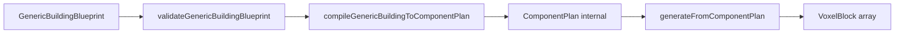

# Plan — Generic Component Building Pivot

**Scoping only — waiting for review before implementation.**

---

## 1. Purpose

This plan **replaces** the prior [Component Infrastructure Consensus](.) plan that recommended a **blacksmith-centered bridge**: internal `ComponentPlan` types plus `compileBlacksmithToComponentPlan()` while leaving `generateBlacksmithWorkshop` output unchanged.

That bridge made sense as a low-risk incremental step, but **product/design review** concluded:

| Prior assumption | Revised view |
|------------------|--------------|
| Blacksmith is the best first compile target | Blacksmith **embodies the old architecture** we are leaving — a second monolithic family generator duplicating rectangular grammar |
| Compiling blacksmith → plan proves the model | It **entrenches** blacksmith as a pseudo–first-class path and invites “compile every family” thinking |
| Keep two shipped families while building components | The active path should move to **`generic_building`**; blacksmith should **exit**, not become the spine |

**We are not abandoning** tower work, shared helpers, validation discipline, or the vision in [`docs/VISION.md`](docs/VISION.md).

**We are abandoning** blacksmith as a product/generator family and **blacksmith as the center of the component transition**.

**New target:** a **generic component-based building generator** where:

- **`GenericBuildingBlueprint`** is the semantic authoring surface (developer lab / future AI).
- **`ComponentPlan`** is **internal compiler IR** only.
- **v1 components** are **exterior-first** modules with **`rectangular_body`** as a real massing component (exactly one primary body in v1).
- **`medieval_tower`** remains a **legacy/specialized** generator for now — not forced through `ComponentPlan` in the first slice.

Core principle (unchanged): **AI plans; code compiles.** No authoritative raw voxel streams from the model.

---

## 2. Current baseline

Repository state on `milestone/generator-expansion` (see [`CHANGE.md`](CHANGE.md)):

### Generation and families

| Item | State |
|------|--------|
| **Shipped `structureType`s** | `medieval_tower`, `blacksmith_workshop` |
| **Generators** | `generateMedievalTower.ts`, `generateBlacksmithWorkshop.ts` |
| **Validators** | Tower in `validateBlueprint.ts`; `validateBlacksmithWorkshop.ts` |
| **Presets** | 6 tower (`sampleBlueprints.ts`); 2 blacksmith (`sampleBlacksmithBlueprints.ts`) |
| **`BUILDING_FAMILIES`** | Both marked `shipped` |
| **`generic_building`** | Does not exist |
| **`ComponentPlan`** | Does not exist |

### UI and exchange

| Surface | State |
|---------|--------|
| **`/preview`** | **Towers \| Blacksmith \| Partials**; default Towers / `northwatch` |
| **`/visualizer`** | Tower-oriented developer lab |
| **`blueprintExchange`** | v1, **tower-only** (`MedievalTowerBlueprint`) |

### Shared infrastructure (keep)

| Item | State |
|------|--------|
| **`placement/placementUtils.ts`** | `mergePlacements`, `filterGrounded`, `centerOrigin`, `GeneratorPlacement` |
| **`facade/paneAxis.ts`** | `paneAxisForWindowCell` |
| **Material metadata** | Classic pack + shape compatibility |
| **Partial blocks** | cube, slab, pane, post |
| **Generator tests** | Tower + blacksmith preset/edge/pane suites; `placementUtils.test.ts`; **79** tests at last full run |

### Not implemented

- AI planner, image interpretation, region selection
- `InteriorPlan`, floor-plan schema
- Style resolver (styles metadata-only for tower)
- Public component JSON / arbitrary component graphs

### Recent history

- Cottage one-off WIP **removed**; helpers extraction **landed** (behavior-neutral for tower/blacksmith).

---

## 3. Revised target architecture

### Short term (this milestone arc)

```text
medieval_tower     → validateMedievalTower → generateMedievalTower()     [legacy/specialized]
generic_building   → validateGenericBuilding → compile → ComponentPlan → generateFromComponentPlan()
blacksmith_workshop → REMOVED from active path
```

### Long term (vision-aligned)

```text
user text / images / selected region
  → AI edits semantic blueprint (GenericBuildingBlueprint + later InteriorPlan)
  → validateGenericBuildingBlueprint()
  → compileGenericBuildingToComponentPlan()   // internal IR
  → generateFromComponentPlan()
  → VoxelBlock[]
  → validation + multi-view preview + iteration
```

**Named building types** (cabin, tavern, chapel, former blacksmith looks) become **presets/recipes** over **`generic_building`** components — not separate `generateFoo.ts` families.

### Integration model (preferred)

```text
Developer lab form / JSON
  → GenericBuildingBlueprint
  → validateGenericBuildingBlueprint()
  → compileGenericBuildingToComponentPlan()
  → generateFromComponentPlan()
  → VoxelBlock[]
```



**`ComponentPlan` is never** the public authoring contract.

---

## 4. Decisions confirmed

| # | Decision |
|---|----------|
| **1** | **Generic component-building path** replaces the blacksmith compile bridge. |
| **2** | **`blacksmith_workshop` removed now** from active product/generator path — not preserved as first `ComponentPlan` consumer. |
| **3** | **`rectangular_body` is a v1 component** — exactly **one** primary `rectangular_body` per plan (id e.g. `body_main`). |
| **4** | **Exterior-first v1 vocabulary:** `rectangular_body`, `foundation`, `hollow_wall_shell`, `entrance_on_side`, `sparse_windows`, `pitched_gable_roof`, `shed_roof`, `chimney`, `front_step`. Interior zones / furniture **deferred**. |
| **5** | **`ComponentPlan` internal-only.** Developer lab may edit **`GenericBuildingBlueprint`** with component-*like* controls; IR stays private. |
| **6** | **No new preview UI** in the first generic slice (no component debug panel, no form redesign). **Exception:** minimal preview **cleanup** when blacksmith is removed (see §11). |
| **7** | **`medieval_tower` legacy/specialized** — not refactored through `ComponentPlan` in this slice. |

---

## 5. Blacksmith removal plan

**Do not delete files in this planning task.** Use this checklist during implementation.

### Files to delete entirely

| Path |
|------|
| `src/lib/blueprints/validateBlacksmithWorkshop.ts` |
| `src/lib/blueprints/sampleBlacksmithBlueprints.ts` |
| `src/lib/generation/generators/generateBlacksmithWorkshop.ts` |
| `src/lib/generation/__tests__/generatorBlacksmithPresetInvariants.test.ts` |
| `src/lib/generation/__tests__/generatorBlacksmithEdgeCaseInvariants.test.ts` |
| `src/lib/generation/__tests__/generatorBlacksmithPanes.test.ts` |
| `src/lib/generation/__tests__/fixtures/blacksmithEdgeCaseBlueprints.ts` |

### Files to edit (remove blacksmith symbols / branches)

| Path | Changes |
|------|---------|
| `src/lib/blueprints/types.ts` | Remove `blacksmith_workshop` from `StructureType`; remove `BlacksmithWorkshop*` interfaces; narrow `StructureBlueprint` / `ResolvedStructure` to tower + generic (when added) |
| `src/lib/blueprints/validateBlueprint.ts` | Remove `validateBlacksmithWorkshop` import and `case "blacksmith_workshop"` |
| `src/lib/generation/generateStructure.ts` | Remove `generateBlacksmithWorkshop` import and dispatch branch |
| `src/lib/generation/families/buildingFamilies.ts` | Remove `blacksmith_workshop` from `BUILDING_FAMILY_IDS` and `BUILDING_FAMILIES` |
| `src/lib/generation/__tests__/buildingFamilies.test.ts` | Expect one shipped family (tower) until generic is cataloged; adjust counts and assertions |
| `src/app/preview/PreviewInspectionClient.tsx` | Remove blacksmith imports, state, `preset_blacksmith` branches, `BLACKSMITH_PRESET_OPTIONS` |
| `src/components/voxel/StructureInspectionPanel.tsx` | Remove `preset_blacksmith` from `PreviewLabSource`; remove Blacksmith tab button; update Partials hint copy |

### Docs / meta (post-implementation, not this planning task)

| Path | Note |
|------|------|
| `docs/generation/GENERATION_DESIGN_PRINCIPLES.md` | §1.5 still mentions blacksmith — update after impl |
| `docs/generation/GENERATOR_RELIABILITY.md` | Blacksmith test rows — update after impl |
| `CHANGE.md` | Implementation report only |

**No blacksmith references** found under `docs/blueprints/` today. [`docs/VISION.md`](docs/VISION.md) mentions blacksmith only as a **future recipe example** — acceptable; optional wording tweak later.

### Must remain unchanged by removal slice

| Asset | Reason |
|-------|--------|
| `placement/placementUtils.ts` | Shared merge/grounding |
| `facade/paneAxis.ts` | Shared façade windows |
| `generateMedievalTower.ts` + tower presets/tests | Legacy path |
| `PARTIAL_BLOCK_SHOWCASE_STRUCTURE` + partial tests | Preview partials mode |
| `VoxelViewer`, layer view, block breakdown | Preview rendering |
| `testUtils.ts` hard invariants | Reused for generic building |
| `blueprintExchange.ts` | Tower-only v1 (unchanged) |
| `/visualizer` | Untouched in first slice |

### Post-removal verification grep

After implementation, expect **zero** matches in `src/` for:

`blacksmith_workshop`, `BlacksmithWorkshop`, `validateBlacksmith`, `generateBlacksmith`, `BLACKSMITH_PRESETS`, `preset_blacksmith`

(Exception: none planned except possibly comments — avoid.)

---

## 6. GenericBuildingBlueprint proposal

**Authoring schema** for developer lab and future AI — **not** `ComponentPlan`.

### Discriminator

```ts
structureType: "generic_building"
schemaVersion: 1   // bump when breaking authoring fields
```

### Suggested shape

```ts
GenericBuildingBlueprint {
  structureType: "generic_building"
  schemaVersion: 1
  metadata: { name, description?, notes? }

  body: {
    width: number
    depth: number
    height: number          // foundation + body + roof vertical budget
    wallThickness: number
    hollowInterior: boolean
  }

  roof: {
    kind: "pitched_gable" | "shed" | "none"
    layers?: number         // optional; validator clamps
    overhang?: number
  }

  openings: {
    entrance: {
      side: "front" | "back" | "left" | "right"
      width: number
      height: number
      // position: optional later (centered default in v1)
    }
    windows: {
      mode: "none" | "front_only" | "front_and_sides" | "all_sides"
      count: number         // or density later; v1 use count
      heightBand?: "upper" | "mid" | "auto"  // v1 may fix to auto/upper
    }
  }

  features: {
    chimney?: { enabled: boolean; side: "left" | "right" }
    frontStep?: { enabled: boolean }   // targets entrance_on_side
  }

  materials: BlueprintMaterials   // classic keys: wall, floor, roof, window, door, accent

  constraints: {
    maxBlockCount: number
    allowFloatingBlocks: boolean
    requireGroundedStructure: boolean
  }
}
```

### Properties

- **Semantic and constrained** — no coordinates, no PRI, no merge order, no aperture masks.
- **Stable** for forms and AI tool schemas.
- **Compiles** to `ComponentPlan` with resolved `BlockTypeId`s and component instance ids.
- **Union:** add to `StructureBlueprint` / `ResolvedStructure` when generic ships (recommended **yes** in same slice as validator).

### Presets (implementation)

- 1–2 curated **`sampleGenericBuildingBlueprints.ts`** presets (e.g. “Rustic cabin-like”, “Simple shed-roof hall”) — **not** blacksmith clones by name, but may **reuse similar dimensions** as regression substitutes for removed blacksmith demos.

---

## 7. Internal ComponentPlan proposal

**Compiler IR only** — not exported in `blueprintExchange` v1; not edited directly in UI.

### Plan envelope

```ts
ComponentPlan {
  planVersion: 1
  sourceStructureType: "generic_building"
  materials: ResolvedMaterials      // registry ids
  constraints: ResolvedConstraints
  compileNotes?: readonly string[]  // validator echoes, clamps
  components: readonly PlannedComponent[]
}
```

### Planned component instance

```ts
PlannedComponent {
  id: string              // e.g. "body_main", "entrance_main", "roof_main"
  kind: ComponentKind
  targets?: readonly string[]   // ids of other components (e.g. entrance → body_main)
  params: ComponentParams       // kind-specific discriminated union
}
```

### v1 `ComponentKind` union

| Kind | Role |
|------|------|
| `rectangular_body` | **Primary massing** — defines W×D×H body layers, wall thickness, hollow flag; anchor for targets |
| `foundation` | y=0 floor over body footprint |
| `hollow_wall_shell` | Perimeter walls + interior y=1 floor in void |
| `entrance_on_side` | Door aperture + door blocks; targets `body_main` |
| `sparse_windows` | Pane/cube windows; targets `body_main` |
| `pitched_gable_roof` | Gable layers; targets `body_main` |
| `shed_roof` | Shed layers; targets `body_main`; mutually exclusive with pitched in one plan |
| `chimney` | Side stack; targets `body_main` |
| `front_step` | Low porch/step at entrance; targets `entrance_main` (or entrance id) |

### v1 invariants

- Exactly **one** `rectangular_body` with id **`body_main`** (constant enforced in compiler).
- At most **one** roof kind with `roof_main` targeting `body_main`.
- `entrance_on_side` id **`entrance_main`** when entrance present.
- Compiler assigns **targets** explicitly; generators must not guess footprint from scratch.

### Example compiled order (canonical emission)

1. `rectangular_body` (establishes frame / may emit nothing or metadata-only pass — see §8)
2. `foundation`
3. `hollow_wall_shell`
4. `sparse_windows`
5. `entrance_on_side`
6. `pitched_gable_roof` | `shed_roof`
7. `chimney`
8. `front_step`

---

## 8. Component generator model

### Recommended v1 contract

| Rule | Choice |
|------|--------|
| Return type | **`GeneratorPlacement[]`** per component |
| Orchestration | Run components in **canonical order**; append to shared array with **monotonic `i`** via `createPlanPush(context, pl)` |
| Merge | **Once** at end: `mergePlacements` → `filterGrounded` if required |
| Priorities | **Central `ComponentPriority` enum** (bands aligned with former blacksmith: foundation 10, wall 30, window 52, door 55, roof 50, chimney 60, step 25, etc.) |
| Openings vs shell | **v1: priority overwrite** — shell skips door/window cells only if compile builds a simple mask; **simpler v1:** shell emits walls everywhere except interior void; windows/doors/entrance emit at higher PRI **over** walls |
| Pane windows | `sparse_windows` uses `paneAxisForWindowCell` + `isShapeAllowedForBlockType` — same as today |
| `front_step` | Targets **`entrance_main`**; places y=0 (and optional y=0 neighbor) blocks **outside** front face cells connected to entrance span |
| Chimney | Targets **`body_main`** side column; rises through roof height computed from body + roof components |
| `maxBlockCount` | **Validator** on `GenericBuildingBlueprint` (estimate); plan does not trim in v1 |
| Purity | Deterministic; validated plan input only |

**Later:** aperture mask object on plan shared by shell + openings (if overwrite proves fragile).

### `rectangular_body` generator

- **v1:** May emit **no placements** — establishes resolved footprint on `PlanContext` for other generators (body id → W, D, H, T, hollow).
- **Alternative:** emit corner markers only in debug — **reject**; keep as context-only unless tests need anchors.

**Recommendation:** `rectangular_body` **sets context** from params; optional zero placements. Compiler fills `PlanContext.footprint` from `body_main.params`.

---

## 9. V1 component scope details

| Component | Purpose | Key params | Targets | Geometry | Validation |
|-----------|---------|------------|---------|----------|------------|
| `rectangular_body` | Single primary mass | W, D, H, T, hollow | — | Context anchor (0 blocks or none) | One per plan; min sizes for hollow + door |
| `foundation` | Ground slab | — | `body_main` | y=0 floor grid | — |
| `hollow_wall_shell` | Envelope | wall material | `body_main` | Perimeter + void floor y=1 | Footprint ≥ 2T+3 if hollow |
| `entrance_on_side` | Door | side, width, height | `body_main` | Door row y=1; aperture y=1..ehy | Width/height vs footprint |
| `sparse_windows` | Façade glass | mode, count, band | `body_main` | Pane or cube at window Y | Count vs span |
| `pitched_gable_roof` | Gable cap | layers | `body_main` | Inset perimeter layers | Exclusive with shed |
| `shed_roof` | Shed cap | layers | `body_main` | Shed inset policy | Exclusive with pitched |
| `chimney` | Stack | side | `body_main` | Wall column + above roof | Side on perimeter |
| `front_step` | Porch step | enabled | `entrance_main` | y=0 accent/floor outside door | Requires entrance |

### Deferred (and why)

| Deferred | Why |
|----------|-----|
| `forge_zone`, `workbench_zone`, `storage_zone` | Interior-first; blacksmith removed |
| Bedrooms, living spaces, furniture | Requires `InteriorPlan` |
| Stairs, floor-plan schema | Circulation / multi-floor |
| Multiple bodies, wings | v1 = one `rectangular_body` |
| Second-story zone assignment | InteriorPlan |
| Window bands, signs, awnings | Façade vocabulary v2 |
| Steeples, buttresses, barn doors | Other families |
| Connection-aware panes/fences | Block system backlog |

---

## 10. Medieval tower handling

| Topic | Policy |
|-------|--------|
| **Status** | **Legacy / specialized** generator — stays in product |
| **ComponentPlan** | **Not** in first generic slice |
| **Shared helpers** | Continues using `placementUtils`, `paneAxis` where applicable |
| **Exchange / visualizer** | Remains tower-focused v1 |
| **Future** | After `generic_building` proves components, decide: (A) tower as specialized component recipe, (B) permanent legacy demo, (C) deprecate from product path |
| **Timing** | Decision **deferred** until generic path has presets, tests, and one dev-lab story |

Tower-specific logic (levels, crenellations, crown, corner pillars) **does not fit** v1 exterior generic components without polluting the vocabulary.

---

## 11. Preview and developer lab strategy

### Decision 6 recap

**No new preview features** in the first generic slice: no component list UI, no generic form in `/preview`, no family dropdown redesign.

### Blacksmith removal forces **minimal** preview cleanup

Removing blacksmith **without** adding generic to preview ⇒ **`/preview` sources become Towers \| Partials only** (two-way toggle).

| Approach | Pros | Cons |
|----------|------|------|
| **A. Towers + Partials only** (recommended for split slice 1) | Honest; zero new UI | Loses low-rise rectangular demo until slice 2 |
| **B. Replace Blacksmith tab with Generic** | Keeps two generator demos | Counts as preview **source** change (still minimal — swap preset list) |

**Recommendation**

- **Removal slice:** **Towers \| Partials** only; update `StructureInspectionPanel` copy.
- **Generic slice:** Add **`preset_generic`** OR wait for **developer lab route** before exposing in `/preview` — see open questions.

### Developer lab (future)

- **`GenericBuildingBlueprint`** controls live on **developer lab** (likely `/visualizer` evolution or dedicated route) — **not** raw `ComponentPlan`.
- **`/visualizer`:** untouched in first implementation slice except if already the lab host later.

---

## 12. Testing strategy

### Blacksmith removal (slice 1)

| Test | Expectation |
|------|-------------|
| `buildingFamilies.test.ts` | Only `medieval_tower` (until generic cataloged) |
| `StructureType` / unions | No `blacksmith_workshop` |
| `validateBlueprint` | No blacksmith route; unknown type fails |
| `generateStructureFromResolved` | Tower branch only (+ generic when added) |
| Blacksmith test files | **Deleted** |
| Tower suites | **Unchanged** |
| `placementUtils.test.ts` | **Unchanged** |

### Generic building (slice 2)

| Test | Expectation |
|------|-------------|
| `validateGenericBuildingBlueprint` | Valid/invalid fixtures |
| `compileGenericBuildingToComponentPlan` | Structural: kinds, ids, order, single `body_main`, roof exclusivity |
| Component unit tests | Per-kind placement smoke on tiny footprints |
| `generateFromComponentPlan` / `generateGenericBuilding` | End-to-end |
| Preset invariants | 1–2 presets: same hard invariants as `testUtils` |
| Parity | **Optional:** none required vs blacksmith (removed); optional vs hand-crafted golden if needed |

### Avoid

- Exact total block-count snapshots unless locking a bugfix.
- Browser/preview UI automation.

### Preview smoke

- Manual or light test: `/preview` loads Towers + Partials after removal (if no automated preview tests exist).

---

## 13. Documentation strategy

**Not in this planning task.** After implementation:

| Document | Action |
|----------|--------|
| `VISION.md` | Minor cross-links only if needed (vision already generic) |
| `GENERATION_DESIGN_PRINCIPLES.md` | Replace blacksmith § with `generic_building` + component model |
| `GENERATOR_RELIABILITY.md` | Remove blacksmith rows; add generic + component tests |
| `BLUEPRINT_FEATURE_CATALOG.md` | Supported types / components |
| `BLUEPRINT_JSON_FORMAT.md` | `generic_building` authoring if JSON exposed in lab |
| New `ARCHITECTURAL_COMPONENT_GRAMMAR.md` | v1 vocabulary + merge order |

---

## 14. Recommended implementation sequence

### Two slices (recommended)

| Slice | Scope | Delivers |
|-------|--------|----------|
| **1 — Remove blacksmith** | Delete §5 files; edit unions/dispatch/catalog/preview; fix tests; **no** generic yet | Clean branch: tower + partials only |
| **2 — Generic building vertical** | Types, validator, compiler, component gens, orchestrator, presets, tests | `generic_building` in library/tests; preview optional |

**Why two slices:** Blacksmith removal is a breaking product change; isolating it makes review and bisect easy. Generic work is already a large vertical slice.

### Slice 2 internal order

1. `components/types.ts` — `ComponentPlan`, kinds, `PlanContext`
2. `components/priorities.ts`
3. `validateGenericBuilding.ts` + types on `GenericBuildingBlueprint`
4. `compileGenericBuildingPlan.ts`
5. `components/generators/*.ts` + `emitFromComponentPlan.ts`
6. `generateGenericBuilding.ts` + `generateStructure` dispatch
7. `sampleGenericBuildingBlueprints.ts` + invariant tests
8. `BUILDING_FAMILIES` entry for `generic_building` when shipped
9. `CHANGE.md` + verification (`pnpm test:generator`, `tsc`, `build`)

### Single-slice alternative (if review prefers one PR)

Combine removal + generic with 1–2 presets and **Towers \| Partials** preview only — acceptable if CI green and diff reviewable.

### Smallest useful vertical slice (product)

```text
Remove blacksmith
+ generic_building with 1–2 presets
+ tests
+ preview = Towers | Partials only (no generic tab yet)
```

Blacksmith **behavior** may inform **preset authoring** but must not remain as a `structureType`.

---

## 15. Non-goals

- AI planner / chat agent runtime
- Image interpretation
- Public **ComponentPlan** JSON schema
- User-authored arbitrary component graphs
- **`InteriorPlan` implementation**
- Multi-view render pipeline
- Selected-region editing
- New taxonomy families (cottage, tavern, barn, …)
- **`cottage_house`**
- **Tower → ComponentPlan refactor**
- **`/visualizer` rewrite** (first slice)
- Import/export v2
- Style resolver
- New textures / block definitions
- Connection-aware blocks / new partial shape kinds
- Minecraft export
- Blacksmith compile bridge / preserving `blacksmith_workshop`
- Preview component debug UI (first slice)

---

## 16. Open questions

1. **`/preview` after generic ships:** Stay **Towers \| Partials** only until developer lab exists, or add **Generic** tab replacing Blacksmith (minimal source swap)?

2. **Developer lab host:** Extend **`/visualizer`** vs new **`/lab`** route for `GenericBuildingBlueprint` forms?

3. **`StructureBlueprint` union:** Add `generic_building` **immediately** when validator lands (recommended **yes**).

4. **Generic presets as demo surface:** Should `rustic_village_forge`-like massing reappear as a **generic** preset (new name) for visual regression in lab only?

5. **Tower migration/removal:** Trigger: generic shipped + dev lab + one product milestone — not this slice.

6. **Blacksmith behavior preservation:** Encode as **generic presets + tests**, not as a family type.

7. **`InteriorPlan` attachment:** Optional field on `GenericBuildingBlueprint` later; v1 exterior-only.

8. **LLM context:** Future packet includes **compiled component summary** (kinds + params), not raw `ComponentPlan` JSON — agree format in grammar doc when implementing.

9. **`rectangular_body` zero placements:** Confirm team accepts context-only anchor vs emitting invisible footprint markers.

10. **`all_sides` window mode:** Include in authoring schema now or defer to `front_and_sides` only in v1?

---

**Scoping only — waiting for review before implementation.**
