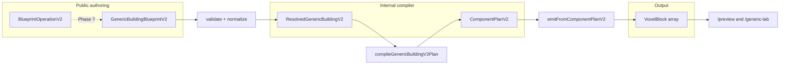

# Plan — GenericBuildingBlueprint v2 (component authoring model)

**Branch:** `feature/component-authoring-model`  
**Status:** Planning only — **no implementation** until review.  
**Goal:** Cohesive implementation of **GenericBuildingBlueprint v2** as an LLM-optimized, component-based semantic architecture compiler, coexisting with **v1** until v2 is stable.

**Related docs (current v1):**

- [`docs/generation/ARCHITECTURAL_COMPONENT_GRAMMAR.md`](docs/generation/ARCHITECTURAL_COMPONENT_GRAMMAR.md) — v1 `ComponentPlan` pipeline
- [`docs/generation/GENERATION_DESIGN_PRINCIPLES.md`](docs/generation/GENERATION_DESIGN_PRINCIPLES.md) — semantic compiler principles
- [`docs/generation/GENERATOR_RELIABILITY.md`](docs/generation/GENERATOR_RELIABILITY.md) — invariant tests
- [`docs/blueprints/BLUEPRINT_FEATURE_CATALOG.md`](docs/blueprints/BLUEPRINT_FEATURE_CATALOG.md) — feature taxonomy
- [`docs/VISION.md`](docs/VISION.md) — product direction (recipes over monoliths)

**Prior work:** Tower-era retirement on branch `cleanup/remove-legacy-visualizer` (see `CHANGE.md`). This plan does **not** reintroduce towers or `blacksmith_workshop`.

---

## Fixed product constraints (do not violate)

| Area | Constraint |
|------|------------|
| Authoring | Constrained **component composition** (`room`, `roof`, `door`, `window_group`, `porch`, `chimney`, `step`); not monolithic whole-building fields |
| IR | **ComponentPlan v2** is private compiler IR — never public editable JSON |
| Coexistence | **schemaVersion** dispatches v1 vs v2; **do not remove v1** until cleanup milestone |
| Migration | Manual v2 presets first; **no automatic v1→v2 converter** in initial work |
| V2.0 scope | **Exactly one root `room`**; attachment-first; no raw coordinates; openings as **first-class** components |
| Deferred | Multiple rooms, walls-as-components, dormers, freeform placement, region selection, image input, **AI runtime**, towers, `blacksmith_workshop` |
| Materials | Global palette + per-component overrides; resolution: **override → blueprint default → compiler default** |
| Validation | Mixed: hard **errors**, safe **normalization notes**, **warnings**; structured for future LLM repair + UI “fix it” |
| Lowering | **New ComponentPlan v2** — do not shoehorn v2 into v1-shaped `ComponentPlan` |
| `/generic-lab` | Human component-tree editor; **no** visual AI operation queue |
| LLM | Full blueprint for create; **semantic operations** for refine; never edit ComponentPlan v2 directly |

### Architecture (target)

```text
GenericBuildingBlueprint v2
  → validate / resolve semantic components
  → ComponentPlan v2 (internal IR)
  → deterministic component emitters
  → VoxelBlock[]
```



```text
Coexistence:

GenericBuildingBlueprint (schemaVersion: 1)  →  ComponentPlan v1  →  emit v1
GenericBuildingBlueprintV2 (schemaVersion: 2) →  ComponentPlanV2 →  emit v2
```

---

## 1. Current repo survey

### 1.1 V1 blueprint & validation

| Path | Role | V2 action |
|------|------|-----------|
| [`src/lib/blueprints/types.ts`](src/lib/blueprints/types.ts) | `GenericBuildingBlueprint` (`schemaVersion: 1`), `ResolvedGenericBuilding`, `StructureBlueprint` | **Extend** — add v2 types; keep v1 types; union `StructureBlueprint` |
| [`src/lib/blueprints/validateBlueprint.ts`](src/lib/blueprints/validateBlueprint.ts) | Dispatches `structureType === "generic_building"` → v1 validator | **Extend** — dispatch on `schemaVersion` |
| [`src/lib/blueprints/validateGenericBuilding.ts`](src/lib/blueprints/validateGenericBuilding.ts) | V1 validation, `BlueprintValidationResult` (errors + notes only) | **Leave v1**; v2 gets richer result type |
| [`src/lib/blueprints/sampleGenericBuildingBlueprints.ts`](src/lib/blueprints/sampleGenericBuildingBlueprints.ts) | V1 presets (`simple_rustic_cabin`, `shed_roof_workshop`) | **Leave**; add separate v2 preset module |
| [`src/lib/blueprints/__tests__/validateGenericBuilding.test.ts`](src/lib/blueprints/__tests__/validateGenericBuilding.test.ts) | V1 validation tests | **Leave**; add v2 validation tests |

**V1 shape assumption:** one monolithic object with `body`, `roof`, `openings`, `features` — conflicts with v2’s **component array** and **surface/anchor** references.

### 1.2 V1 generation & ComponentPlan v1

| Path | Role | V2 action |
|------|------|-----------|
| [`src/lib/generation/generateStructure.ts`](src/lib/generation/generateStructure.ts) | `generateStructureFromResolved` → `generateGenericBuilding` | **Extend** — branch on resolved v1 vs v2 |
| [`src/lib/generation/generators/generateGenericBuilding.ts`](src/lib/generation/generators/generateGenericBuilding.ts) | v1: compile v1 plan → emit | **Leave** as v1 entry |
| [`src/lib/generation/components/types.ts`](src/lib/generation/components/types.ts) | `ComponentPlan` v1, `PlannedComponent` kinds | **Leave**; add `components/v2/types.ts` |
| [`src/lib/generation/components/compileGenericBuildingPlan.ts`](src/lib/generation/components/compileGenericBuildingPlan.ts) | Lowers **monolithic** resolved building → fixed ids (`body_main`, `entrance_main`, …) | **Do not extend** for v2 — new `compileGenericBuildingV2Plan.ts` |
| [`src/lib/generation/components/geometry/openingMask.ts`](src/lib/generation/components/geometry/openingMask.ts) | Derives masks from **resolved v1** `openings` + `body` | **Refactor shared math** where possible; v2 lowering feeds masks from **door/window_group** plan nodes |
| [`src/lib/generation/components/emitFromComponentPlan.ts`](src/lib/generation/components/emitFromComponentPlan.ts) | v1 emitter dispatch + merge + grounding | **Leave**; add `emitFromComponentPlanV2.ts` |
| [`src/lib/generation/components/generators/*`](src/lib/generation/components/generators/) | foundation, hollowWallShell, entranceOnSide, sparseWindows, roofs, chimney, frontStep | **Reuse/adapt** — many map to v2 plan kinds |
| [`src/lib/generation/components/priorities.ts`](src/lib/generation/components/priorities.ts) | Merge priorities | **Reuse** (possibly extend for porch) |
| [`src/lib/generation/placement/placementUtils.ts`](src/lib/generation/placement/placementUtils.ts) | merge, 26-connectivity filter | **Reuse** unchanged |
| [`src/lib/generation/facade/paneAxis.ts`](src/lib/generation/facade/paneAxis.ts) | Window pane axis helper | **Reuse** |
| [`src/lib/generation/families/buildingFamilies.ts`](src/lib/generation/families/buildingFamilies.ts) | Single `generic_building` family | **Leave** (v2 = same family, new schema version) |

### 1.3 UI routes

| Path | Role | V2 action |
|------|------|-----------|
| [`src/app/preview/PreviewInspectionClient.tsx`](src/app/preview/PreviewInspectionClient.tsx) | V1 generic presets + partials | **Extend** — preset groups: “Generic v1” / “Generic v2” |
| [`src/app/preview/page.tsx`](src/app/preview/page.tsx) | Preview shell copy | **Update** when v2 presets ship |
| [`src/app/generic-lab/GenericLabClient.tsx`](src/app/generic-lab/GenericLabClient.tsx) | Monolithic form editor for v1 | **Extend** — schemaVersion toggle or tab: v1 editor vs **v2 component tree** |
| [`src/app/generic-lab/genericLabUtils.ts`](src/app/generic-lab/genericLabUtils.ts) | V1 clamps, preset clone | **Extend** — v2 tree helpers |
| [`src/app/generic-lab/GenericLabInspectionPanel.tsx`](src/app/generic-lab/GenericLabInspectionPanel.tsx) | Layer/breakdown (preset-agnostic) | **Reuse** for v2 preview |
| [`src/components/voxel/VoxelViewer.tsx`](src/components/voxel/VoxelViewer.tsx) | R3F viewer | **Leave** |
| [`src/components/voxel/StructureInspectionPanel.tsx`](src/components/voxel/StructureInspectionPanel.tsx) | Preview side panel | **Extend** preset grouping for v2 |

### 1.4 Tests & docs

| Path | Role | V2 action |
|------|------|-----------|
| `src/lib/generation/__tests__/generatorGenericPresetInvariants.test.ts` | V1 preset invariants | **Leave** |
| `src/lib/generation/__tests__/generatorPipeline.smoke.test.ts` | Smoke (v1 default) | **Add** v2 smoke; keep v1 |
| `src/lib/generation/components/__tests__/compileGenericBuildingPlan.test.ts` | v1 lowering | **Leave** |
| `docs/generation/ARCHITECTURAL_COMPONENT_GRAMMAR.md` | Documents v1 | **Update** in Phase 8 — mark v1, document v2 |
| `docs/blueprints/BLUEPRINT_JSON_FORMAT.md` | Generic internal JSON | **Update** — v2 authoring; still no public ComponentPlan |

### 1.5 Conflicting v1 assumptions (must not carry into v2)

1. **Single implicit “main body”** — v1 hardcodes `body_main`, `entrance_main`, `roof_main`; v2 uses **author-defined slug IDs** and **surface references** (`main-room.front`).
2. **Openings nested in blueprint** — v1 `openings.entrance` / `openings.windows`; v2 **`door`** and **`window_group`** are sibling components.
3. **Features flags** — v1 `features.chimney.enabled` / `frontStep.enabled`; v2 **optional components** in the `components` array.
4. **Entrance side on building** — v2 door targets a **surface**; compiler maps surface → facade side + span.
5. **Window mode enum on building** — v2 `window_group` has distribution + height band per group.
6. **Validation result shape** — v1 flat `errors[]` / `notes[]`; v2 needs **paths, component IDs, severity, codes** for LLM repair.
7. **Lowering = field copy** — v1 `compileGenericBuildingToComponentPlan` is mostly structural mapping; v2 must **resolve attachments**, build **plan graph**, derive **aperture masks** from multiple opening components.

---

## 2. Proposed file / module layout

```
src/lib/blueprints/
  types.ts                          # extend: v1 unchanged; export v2 + unions
  types/
    genericBuildingV1.ts            # optional: move v1 types when types.ts grows
    genericBuildingV2.ts            # public v2 authoring + resolved v2
    materials.ts                    # shared palette / override types
    validationResult.ts             # structured ValidationResult (v2); v1 adapter
  validateBlueprint.ts              # schemaVersion dispatch
  validateGenericBuilding.ts        # v1 only
  validateGenericBuildingV2.ts      # v2 validate + normalize
  resolveGenericBuildingV2.ts       # resolved semantic graph (surfaces, anchors)
  sampleGenericBuildingBlueprints.ts  # v1 presets (unchanged)
  sampleGenericBuildingBlueprintsV2.ts
  operations/
    types.ts                        # LLM semantic operation unions
    applyOperations.ts              # Phase 7+: apply ops to blueprint (pure)
  __tests__/
    validateGenericBuildingV2.test.ts
    resolveGenericBuildingV2.test.ts
    operations.test.ts              # Phase 7

src/lib/generation/
  generateStructure.ts              # dispatch resolved v1 | v2
  generators/
    generateGenericBuilding.ts      # v1 entry (unchanged)
    generateGenericBuildingV2.ts    # v2 entry
  components/
    v1/                             # optional rename: move existing v1 files
      types.ts
      compileGenericBuildingPlan.ts
      emitFromComponentPlan.ts
      ...
    v2/
      types.ts                      # ComponentPlanV2, PlanComponent union
      compileGenericBuildingV2Plan.ts
      emitFromComponentPlanV2.ts
      resolveAttachments.ts
      deriveSurfaces.ts
      deriveApertureMasksV2.ts
      planContextV2.ts
      generators/
        roomShell.ts
        roof.ts
        door.ts
        windowGroup.ts
        porch.ts
        chimney.ts
        step.ts
      __tests__/
        compileGenericBuildingV2Plan.test.ts
        deriveApertureMasksV2.test.ts
        emitV2.invariants.test.ts
        fixtures/
          validV2Presets.ts
          invalidV2Blueprints.ts

src/app/generic-lab/
  GenericLabClient.tsx              # v1 editor + v2 mode switch
  v2/
    GenericLabV2Client.tsx
    ComponentTreePanel.tsx
    ComponentInspectorPanel.tsx
    ValidationPanel.tsx
    genericLabV2Utils.ts

src/app/preview/
  PreviewInspectionClient.tsx       # v1 + v2 preset sections
```

**Docs (Phase 8, in existing paths):**

- Extend `docs/generation/ARCHITECTURAL_COMPONENT_GRAMMAR.md` — v2 component + attachment vocabulary
- Extend `docs/blueprints/BLUEPRINT_JSON_FORMAT.md` — v2 authoring reference
- Update `docs/generation/GENERATOR_RELIABILITY.md` — v2 test inventory
- Update `docs/blueprints/BLUEPRINT_FEATURE_CATALOG.md` — v2 active sections

---

## 3. Proposed V2 schema (TypeScript shapes)

### 3.1 Root blueprint

```ts
/** Public authoring — LLM and /generic-lab edit this. */
export interface GenericBuildingBlueprintV2 {
  readonly structureType: "generic_building";
  readonly schemaVersion: 2;
  readonly metadata: BlueprintMetadata;
  readonly defaults: BlueprintMaterialDefaults;
  readonly constraints: BlueprintConstraints;
  readonly components: readonly GenericBuildingComponentV2[];
}

export type StructureBlueprint =
  | GenericBuildingBlueprint   // schemaVersion: 1
  | GenericBuildingBlueprintV2;

export interface BlueprintMaterialDefaults {
  readonly wall: ClassicMaterialKey;
  readonly floor: ClassicMaterialKey;
  readonly roof: ClassicMaterialKey;
  readonly window: ClassicMaterialKey;
  readonly door: ClassicMaterialKey;
  readonly accent: ClassicMaterialKey;
}

export interface ComponentMaterialOverride {
  readonly wall?: ClassicMaterialKey;
  readonly floor?: ClassicMaterialKey;
  readonly roof?: ClassicMaterialKey;
  readonly window?: ClassicMaterialKey;
  readonly door?: ClassicMaterialKey;
  readonly accent?: ClassicMaterialKey;
}
```

### 3.2 Component identity and naming rules

```ts
/** Canonical programmatic identity — slug, stable across edits. */
export type ComponentId = string; // validated: /^[a-z][a-z0-9-]*$/

export interface ComponentBaseV2 {
  readonly id: ComponentId;
  readonly type: GenericBuildingComponentTypeV2;
  /** Human display only; not used for references. */
  readonly label?: string;
  readonly materials?: ComponentMaterialOverride;
}

export type GenericBuildingComponentTypeV2 =
  | "room"
  | "roof"
  | "door"
  | "window_group"
  | "porch"
  | "chimney"
  | "step";

export type GenericBuildingComponentV2 =
  | RoomComponentV2
  | RoofComponentV2
  | DoorComponentV2
  | WindowGroupComponentV2
  | PorchComponentV2
  | ChimneyComponentV2
  | StepComponentV2;
```

**ID rules:**

- Persisted/resolved components must have an `id`.
- Lowercase slug: letters, numbers, hyphens (e.g. `main-room`, `front-door`, `front-windows`).
- Used for references, operations, validation messages, compiler diagnostics, semantic provenance, `/generic-lab` selection.
- Optional `label` for display only.
- System may suggest deterministic IDs for new components.
- Once assigned, IDs remain stable — do not auto-rename when properties change.

### 3.3 Semantic references (attachment vocabulary)

```ts
export type RoomFace = "front" | "back" | "left" | "right" | "roof";
export type RoomSurfaceRef = `${ComponentId}.${RoomFace}`;

export interface SurfaceAttachment {
  readonly surface: RoomSurfaceRef;
  readonly placement: HorizontalPlacementV2;
}

export interface HorizontalPlacementV2 {
  readonly align: "start" | "center" | "end";
  // defer: offsetCells, corner targets
}

export interface DoorAnchorAttachment {
  readonly door: ComponentId;
}
```

**V2.0 derived surfaces (example):** `main-room.front`, `main-room.back`, `main-room.left`, `main-room.right`, `main-room.roof`.

**V2.0 anchors (example):** `front-door` (step targets door).

**Placement vocabulary (constrained):**

| Component | Targets | Placement fields |
|-----------|---------|------------------|
| `door` | room surface | horizontal `align` |
| `window_group` | room surface | `align`, `distribution`, `heightBand`, `count` |
| `roof` | `{root}.roof` | `kind`, `layers`, `overhang`, shed `orientation` |
| `porch` | room surface | `depth`, `widthMode`, optional `aroundDoor` |
| `chimney` | wall surface | simple horizontal placement |
| `step` | door component | door anchor only |

**Deferred:** corner targets, freeform offsets, surface subdivision, multiple anchors, region selection, multi-room surfaces.

### 3.4 Component variants

```ts
export interface RoomComponentV2 extends ComponentBaseV2 {
  readonly type: "room";
  readonly width: number;
  readonly depth: number;
  readonly wallHeight: number;
  readonly wallThickness: number;
  readonly hollowInterior: boolean;
  readonly role?: "root";
}

export type RoofKindV2 = "pitched_gable" | "shed" | "none";
export type ShedOrientationV2 = "front_back" | "left_right";

export interface RoofComponentV2 extends ComponentBaseV2 {
  readonly type: "roof";
  readonly target: RoomSurfaceRef;
  readonly kind: RoofKindV2;
  readonly layers?: number;
  readonly overhang?: number;
  readonly orientation?: ShedOrientationV2;
}

export interface DoorComponentV2 extends ComponentBaseV2 {
  readonly type: "door";
  readonly attach: SurfaceAttachment;
  readonly width: number;
  readonly height: number;
}

export type WindowDistributionV2 = "single" | "pair" | "row";
export type WindowHeightBandV2 = "auto" | "mid" | "upper";

export interface WindowGroupComponentV2 extends ComponentBaseV2 {
  readonly type: "window_group";
  readonly attach: SurfaceAttachment;
  readonly count: number;
  readonly distribution: WindowDistributionV2;
  readonly heightBand?: WindowHeightBandV2;
}

export type PorchWidthModeV2 = "door_only" | "full_facade";

export interface PorchComponentV2 extends ComponentBaseV2 {
  readonly type: "porch";
  readonly attach: SurfaceAttachment;
  readonly depth: number;
  readonly widthMode: PorchWidthModeV2;
  readonly aroundDoor?: ComponentId;
}

export interface ChimneyComponentV2 extends ComponentBaseV2 {
  readonly type: "chimney";
  readonly attach: SurfaceAttachment;
}

export interface StepComponentV2 extends ComponentBaseV2 {
  readonly type: "step";
  readonly attach: DoorAnchorAttachment;
}
```

### 3.5 Resolved v2 (internal — not public JSON)

```ts
export interface ResolvedGenericBuildingV2 {
  readonly structureType: "generic_building";
  readonly schemaVersion: 2;
  readonly metadata: BlueprintMetadata;
  readonly constraints: BlueprintConstraints;
  readonly rootRoomId: ComponentId;
  readonly materials: ResolvedMaterialPalette;
  readonly components: readonly ResolvedComponentV2[];
  readonly surfaces: ReadonlyMap<RoomSurfaceRef, ResolvedSurfaceV2>;
  readonly anchors: ReadonlyMap<ComponentId, ResolvedAnchorV2>;
  readonly grid: PlanBoundsV2;
}

export interface ResolvedComponentV2 {
  readonly id: ComponentId;
  readonly type: GenericBuildingComponentTypeV2;
  readonly materials: ResolvedMaterialPalette;
  // type-specific resolved fields + resolved attachment targets
}
```

---

## 4. Proposed validation result shape

```ts
export type ValidationSeverity = "error" | "warning" | "note";

export interface ValidationIssue {
  readonly severity: ValidationSeverity;
  readonly code: string;
  readonly message: string;
  readonly path?: string;
  readonly componentId?: ComponentId;
  readonly surface?: RoomSurfaceRef;
  readonly anchor?: ComponentId;
  readonly suggestion?: string;
}

export interface BlueprintValidationResultV2 {
  readonly ok: boolean;
  readonly errors: readonly ValidationIssue[];
  readonly warnings: readonly ValidationIssue[];
  readonly notes: readonly ValidationIssue[];
  readonly resolved?: ResolvedGenericBuildingV2;
  readonly normalized?: GenericBuildingBlueprintV2;
}
```

| Severity | Examples |
|----------|----------|
| **error** | duplicate id, zero/multiple rooms, unknown surface, door too wide, invalid material, step not on door, roof target not `.roof` |
| **note** | clamped dimensions, defaulted `layers`/`align`, inserted optional fields |
| **warning** | high window count, large porch depth, chimney on front facade |

V1 keeps `BlueprintValidationResult` (`errors[]` / `notes[]` strings) until optional unification later.

---

## 5. Resolution model

```text
GenericBuildingBlueprintV2 (authoring)
  → parse / structural checks (ids, types, duplicates)
  → detect exactly one room → rootRoomId
  → per-component type validation
  → resolve material inheritance (override → defaults → compiler fallbacks)
  → build surface catalog from root room
  → resolve attachments (surface → facade; door → anchor frame)
  → group openings per facade
  → plan aperture cells (shell skip, window fill, door trim)
  → compute PlanBoundsV2
  → estimate block budget vs maxBlockCount
  → ResolvedGenericBuildingV2
```

| Step | Responsibility |
|------|----------------|
| ID validation | `^[a-z][a-z0-9-]*$`, unique set |
| Root room | exactly one `type === "room"` |
| Material inheritance | per-component resolved palette |
| Surface derivation | room box at origin; faces `roomId.face` |
| Target resolution | parse surface ref; must be root room |
| Anchor resolution | step → door component |
| Opening grouping | by facade; non-overlap where possible |
| Aperture planning | merge masks; y=0 floor band (v1 parity) |
| Bounds | y=0 slab, walls y≥1, roof above body |
| Budget | v1-style estimate or component sum |

**No user-authored world coordinates in V2.0** — compiler assigns lattice from root room at origin.

---

## 6. ComponentPlan v2 design

### 6.1 Public vs internal vs output

| Layer | Public? |
|-------|---------|
| `GenericBuildingBlueprintV2` | **Yes** |
| `ResolvedGenericBuildingV2` | **Internal** |
| `ComponentPlanV2` | **Internal** — never LLM-editable |
| `VoxelBlock[]` | Output — inspectable only |

### 6.2 ComponentPlanV2 shape

```ts
export interface ComponentPlanV2 {
  readonly planVersion: 2;
  readonly sourceSchemaVersion: 2;
  readonly rootRoomId: ComponentId;
  readonly bounds: PlanBoundsV2;
  readonly materials: ResolvedMaterialPalette;
  readonly constraints: BlueprintConstraints;
  readonly openings: DerivedOpeningsV2;
  readonly components: readonly PlanComponentV2[];
  readonly compileNotes?: readonly string[];
}

export interface PlanBoundsV2 {
  readonly origin: { readonly x: number; readonly y: number; readonly z: number };
  readonly width: number;
  readonly depth: number;
  readonly bodyLayers: number;
  readonly roofLayers: number;
  readonly overhang: number;
}

export type PlanComponentV2 =
  | PlanRoomShellV2
  | PlanRoofV2
  | PlanDoorV2
  | PlanWindowGroupV2
  | PlanPorchV2
  | PlanChimneyV2
  | PlanStepV2;
```

**Lowering map (do not reuse v1 plan kinds):**

| Authoring | Plan v2 kind | Emitter |
|-----------|--------------|---------|
| `room` | `room_shell` | foundation + hollow shell |
| `door` | `door` | aperture + trim (v1 entrance logic) |
| `window_group` | `window_group` | sparse windows |
| `roof` | `roof` | gable / shed / none |
| `porch` | `porch` | **new** v2.0 emitter |
| `chimney` | `chimney` | adapt v1 |
| `step` | `step` | adapt v1 frontStep (door-anchored) |

### 6.3 Provenance (optional V2.0)

Internal placements may carry `sourceComponentId` / `sourcePlanKind`. Defer public `VoxelBlock` provenance until inspection UI needs it.

---

## 7. Emitters

```text
ComponentPlanV2
  → createPlanContextV2(plan)
  → emit in order → GeneratorPlacement[]
  → mergePlacements (COMPONENT_PRI)
  → filterGroundedConnected26
  → VoxelBlock[]
```

**Emission order (proposed):**

1. `room_shell`
2. `porch`
3. `door` / `window_group` (masks applied in shell)
4. `roof`
5. `chimney`
6. `step`

**Reuse:** `mergePlacements`, `filterGroundedConnected26`, `paneAxisForWindowCell`, `priorities.ts`.

**New:** porch emitter; multi `window_group` per facade validation.

---

## 8. V1 / V2 dispatch

```ts
// validateBlueprint(blueprint)
if (blueprint.structureType !== "generic_building") return unsupported;
switch (blueprint.schemaVersion) {
  case 1: return validateGenericBuildingBlueprint(blueprint);
  case 2: return validateGenericBuildingBlueprintV2(blueprint);
  default: return error;
}

// generateStructureFromResolved(resolved)
if (resolved.schemaVersion === 1) return generateGenericBuilding(resolved);
if (resolved.schemaVersion === 2) return generateGenericBuildingV2(resolved);
```

- V1 preset files unchanged in early phases.
- All v1 tests stay green until v1 retirement.
- Call sites narrow on `schemaVersion`.

---

## 9. Presets

**Location:** `src/lib/blueprints/sampleGenericBuildingBlueprintsV2.ts`

```ts
export const GENERIC_BUILDING_V2_PRESETS = [
  { id: "simple_cabin_v2", label: "Simple cabin (v2)", blueprint: ... },
  { id: "stone_workshop_v2", label: "Stone workshop (v2)", blueprint: ... },
  { id: "porch_house_v2", label: "Porch house (v2)", blueprint: ... },
] as const;
```

| Preset | v1 analogue | Component ids (illustrative) |
|--------|-------------|------------------------------|
| `simple_cabin_v2` | `simple_rustic_cabin` | `main-room`, `main-roof`, `front-door`, `front-windows`, `chimney`, `front-step` |
| `stone_workshop_v2` | `shed_roof_workshop` | wider room, shed roof, large door, side windows |
| `porch_house_v2` | new demo | room, gable roof, door, windows, **porch**, step |

**Staged transition:**

1. V1 and V2 presets side by side.
2. Add manually authored V2 presets (labeled section).
3. Make V2 primary when reliable.
4. Hide V1 as fallback/regression fixture.
5. Remove V1 in cleanup branch (§14).

**`/preview`:** grouped **Generic v1** / **Generic v2**; default **v1** until product switches.

---

## 10. `/generic-lab` V2 UI

```text
┌─────────────────────────────────────────────────────────────┐
│ Header: preset | v1/v2 toggle | link to /preview           │
├──────────────┬──────────────────────────┬───────────────────┤
│ Component    │ Voxel preview            │ Validation panel  │
│ tree         │                          │ errors/warnings/  │
│              ├──────────────────────────┤ notes             │
│              │ Inspector (selected)     │                   │
├──────────────┴──────────────────────────┴───────────────────┤
│ Collapsible: read-only V2 JSON | debug ComponentPlan v2      │
└─────────────────────────────────────────────────────────────┘
```

**Tree grouping:** root room → surfaces → attached doors/windows/porches/chimneys; roof node; steps under doors.

| Milestone | Capability |
|-----------|------------|
| **6a** | Read-only tree + validation + preview |
| **6b** | Inspector edits + revalidate |
| **6c** | Add/remove components; material overrides |
| **Later** | “Fix it” from `ValidationIssue.suggestion` |

**No** visual AI operation queue. V1 monolithic editor remains via toggle/tab.

---

## 11. LLM operation model

```ts
export type BlueprintOperationV2 =
  | AddComponentOperation
  | UpdateComponentOperation
  | RemoveComponentOperation
  | SetMaterialPaletteOperation
  | SetMaterialOverrideOperation;

export interface AddComponentOperation {
  readonly op: "addComponent";
  readonly component: GenericBuildingComponentV2;
}

export interface UpdateComponentOperation {
  readonly op: "updateComponent";
  readonly id: ComponentId;
  readonly patch: Partial</* per-type */>;
}

export interface RemoveComponentOperation {
  readonly op: "removeComponent";
  readonly id: ComponentId;
}

export interface SetMaterialPaletteOperation {
  readonly op: "setMaterialPalette";
  readonly defaults: Partial<BlueprintMaterialDefaults>;
}

export interface SetMaterialOverrideOperation {
  readonly op: "setMaterialOverride";
  readonly id: ComponentId;
  readonly materials: ComponentMaterialOverride;
}
```

| Phase | Deliverable |
|-------|-------------|
| **7a** | Types + doc comments |
| **7b** | `applyOperations(blueprint, ops)` + tests |
| **Later** | API, repair loop, prompts |

**Recommendation:** Phase 7 after validate/compile/emit work. **Create:** full `GenericBuildingBlueprintV2`. **Refine:** semantic operations (not JSON Patch, not ComponentPlan v2).

---

## 12. Tests

### 12.1 New v2 tests

| File | Cases |
|------|-------|
| `validateGenericBuildingV2.test.ts` | valid presets; duplicate id; no room; two rooms; bad slug; door too wide; materials |
| `resolveGenericBuildingV2.test.ts` | invalid surface; roof not `.roof`; invalid anchor |
| `compileGenericBuildingV2Plan.test.ts` | plan kinds; bounds; masks |
| `emitV2.invariants.test.ts` | hard invariants per v2 preset |
| `generatorPipelineV2.smoke.test.ts` | validate → generate non-empty |
| `operations.test.ts` | add/update/remove (Phase 7) |

### 12.2 Preserved v1 tests

- `validateGenericBuilding.test.ts`
- `compileGenericBuildingPlan.test.ts`
- `generatorGenericPresetInvariants.test.ts`
- `generatorPipeline.smoke.test.ts`

Reuse `src/lib/generation/__tests__/testUtils.ts` invariant helpers.

---

## 13. Phased implementation plan

### Phase 1 — Types + fixtures

- v2 types, `StructureBlueprint` union, guards
- Fixture TS for 3 v2 presets + invalid cases
- **No dispatch, no emitters**

**Exit:** `tsc` passes; v1 untouched

### Phase 2 — Validation + normalization

- `validateGenericBuildingBlueprintV2`, structured results
- ID rules, root room, materials, attachments

**Exit:** validation tests green

### Phase 3 — Resolution + ComponentPlan v2 lowering

- `resolveGenericBuildingV2`, `compileGenericBuildingV2Plan`, `deriveApertureMasksV2`
- Plan snapshot tests only (no voxels)

**Exit:** lowering tests green

### Phase 4 — Emitters + generation

- `generateGenericBuildingV2`, `emitFromComponentPlanV2`, porch emitter
- Wire `generateStructure` dispatch
- Invariant tests

**Exit:** v2 + v1 tests green

### Phase 5 — Presets + `/preview`

- Ship v2 presets; grouped preview picker

**Exit:** manual preview v1 + v2

### Phase 6 — `/generic-lab` component tree

- 6a read-only → 6b edit → 6c add/remove

**Exit:** end-to-end v2 edit in lab

### Phase 7 — LLM operations (optional)

- Types + `applyOperations` + tests

### Phase 8 — Docs + v1 deprecation prep

- Update grammar, JSON format, reliability, feature catalog
- **Do not remove v1**

### Validation commands (every implementation PR)

```bash
pnpm lint
pnpm test:generator
pnpm exec tsc --noEmit
pnpm run build
```

---

## 14. V1 deprecation criteria (future cleanup branch)

V1 may be retired only when:

- [ ] Multiple manually authored **v2** presets cover visible demo cases (cabin, workshop, porch house)
- [ ] Each v2 preset validates, compiles through **ComponentPlan v2**, renders in `/preview` and `/generic-lab`
- [ ] Tests cover v2 validation, lowering, emission, structural invariants
- [ ] `pnpm lint`, `pnpm test:generator`, `tsc`, `build` pass
- [ ] Docs identify **v2 as active** generic path
- [ ] `/generic-lab` v2 editor is primary; v1 hidden or fixture-only

Then delete v1 in a dedicated **cleanup** branch.

---

## 15. Clarifications needed before implementation

Items **1–12** below were reviewed and **resolved in §16**. Remaining open items (not blocking Phase 1):

- **Material vocabulary** — Same `CLASSIC_BLOCK_PACK` keys as v1? New roles beyond wall/floor/roof/window/door/accent?
- **Roof kinds / shed orientation** — Is `ShedOrientationV2` (`front_back` | `left_right`) correct? Omit `roof` component vs `kind: "none"`?
- **Root room defaults** — Reuse v1 clamps (W 5–17, D 5–13, height 4–9, T 1–2)?
- **`/generic-lab` first ship** — Phase 6a read-only OK, or minimal editing required before merge?
- **Preview default** — Switch to v2 when stable, or keep v1 until cleanup?
- **Validation codes** — Stable `code` registry const for LLM repair?

---

## 16. Clarification decisions (resolved)

Review answers for schema and Phase 1 boundaries. Each item: **recommendation**, **why**, **tradeoff/risk**, **Phase impact**.

### 16.1 Material field naming

**Recommendation:** Use **`materials`** at the blueprint root for the global palette.

**Why:** Matches v1 (`materials: BlueprintMaterials`), decision language (“blueprint-level material palette”), and how LLMs phrase edits (“set wall material”). Per-component overrides stay on each component as optional **`materials`** (same role names, partial object). Avoid `defaults` (ambiguous with constraint defaults) and `materialDefaults` (verbose).

**Tradeoff/risk:** Root `materials` vs component `materials` overload — mitigate with type names (`BlueprintMaterialPalette` at root, `ComponentMaterialOverride` on components).

**Phase:** **Blocks Phase 1** — fix public field name when defining v2 types.

---

### 16.2 Surface attachment field shape

**Recommendation:** Consistent pattern for surface-attached components:

```ts
attach: {
  targetSurface: "main-room.front",
  placement: { ... }
}
```

Use **`targetSurface`** inside **`attach`** (not a bare top-level field) so every attachable component shares **`attach`**, while step uses a parallel shape: `attach: { targetDoor: "front-door" }`.

**Why:** `targetSurface` is explicit for LLMs. Nesting under `attach` distinguishes surface vs door attachment structurally.

**Roof exception:** See §16.5 — roof uses `targetRoom`, not `attach.targetSurface`.

**Tradeoff/risk:** Slightly more nesting than flat fields; worth it for cross-component consistency.

**Phase:** **Blocks Phase 1** — schema shape in types/fixtures.

---

### 16.3 Placement vocabulary

**Recommendation:** Facade-relative horizontal placement:

**`placement.horizontal: "left" | "center" | "right"`**

Always relative to the **outward-facing facade** (viewer standing outside that wall). Do **not** use `start`/`end`. Do **not** use `near-front`/`near-back` in v2.0.

**V2.0 per component:**

| Component | Placement fields |
|-----------|------------------|
| **door** | `horizontal: left \| center \| right` (default `center`) |
| **window_group** | `horizontal` for group anchor; plus `layout` + `count` (§16.7) along facade |
| **porch** | `horizontal: center` only in v2.0; width from `widthMode` + optional `aroundDoor` |
| **chimney** | `horizontal: left \| right` on side walls; `left \| center \| right` on front/back; validate per surface |
| **roof** | No horizontal placement; use `kind`, `layers`, `overhang`, shed `orientation` |
| **step** | No horizontal placement; derived from target door |

**Tradeoff/risk:** Left/right on `back` requires one documented viewer-outside convention; compiler encodes it.

**Phase:** **Phase 1** — enum in types; **Phase 2** — per-surface validation rules.

---

### 16.4 Surface references

**Recommendation:**

- **Public schema:** string **`targetSurface`** = `{roomId}.{face}` with `face ∈ front | back | left | right | roof`.
- **Resolved/internal:** structured **`{ roomId: ComponentId, face: RoomFace }`** after parse/validate.

**Why:** Strings are best for LLM JSON and presets; structs prevent drift in compiler/emitters and improve `ValidationIssue` fields.

**Tradeoff/risk:** Must reject malformed strings early.

**Phase:** **Phase 1** — document format + parser/types; **Phase 2** — resolution to struct.

---

### 16.5 Roof target

**Recommendation:** Public roof does **not** primarily use `main-room.roof`.

```ts
{
  type: "roof",
  id: "main-roof",
  targetRoom: "main-room",
  kind: "pitched_gable" | "shed" | "none",
  ...
}
```

Compiler maps `targetRoom` → internal roof surface / plan bounds.

**Why:** LLMs naturally say “roof over the main room.” `.roof` as a surface is derived topology.

**Tradeoff/risk:** Roof breaks the `attach.targetSurface` pattern; document explicitly.

**Phase:** **Blocks Phase 1** — public roof shape in types; **Phase 3** — lowering.

---

### 16.6 Step and porch attachment

**Recommendation (V2.0):**

| Component | Rule |
|-----------|------|
| **step** | **`attach.targetDoor` required**; target must be `type: "door"`; at most one step per door |
| **porch** | **`attach.targetSurface` required**; **`aroundDoor` optional** — required when `widthMode: "door_only"`; absent when `widthMode: "full_facade"` |

Defer step→porch until v2.1.

**Tradeoff/risk:** If `aroundDoor` is set, require `widthMode: "door_only"`.

**Phase:** **Phase 1** types; **Phase 2** validation; porch emitter **Phase 4**.

---

### 16.7 Window distribution semantics

**Recommendation:** Drop `single | pair | row`. Use:

```ts
{
  type: "window_group",
  attach: { targetSurface, placement: { horizontal: "center" } },
  count: number,
  layout: "symmetric" | "even",
  heightBand?: "auto" | "mid" | "upper"
}
```

- **`symmetric`:** slots mirrored about facade center.
- **`even`:** spread `count` slots with minimum gap along interior span.

For `count: 1`, `layout` may be ignored.

**Why:** `single/pair/row` overlaps with `count` and confuses LLMs.

**Tradeoff/risk:** Two layout words need preset/docs examples.

**Phase:** **Phase 1** field names; **Phase 2–3** slot logic + tests.

---

### 16.8 ComponentPlan v2 opening representation

**Recommendation:** **Separate plan kinds** for door and window_group (e.g. `plan_door`, `plan_window_group`), each with resolved aperture data — **not** a unified public `opening` type.

Shared **`DerivedOpeningsV2`** mask set (shell skip / window / door), same pattern as v1.

**Why:** Emitters align with v1 entrance vs window paths; unified `openingType` adds abstraction without v2.0 benefit.

**Tradeoff/risk:** Two emitter paths; share mask derivation module.

**Phase:** **Does not block Phase 1** — IR in **Phase 3**.

---

### 16.9 V1 file organization

**Recommendation:** **Do not move** v1 into `components/v1/` early. Add **`src/lib/generation/components/v2/`** beside existing v1 files.

**Why:** Avoids large churn with no user value until v2 works. Optional v1 folder move at retirement or dedicated refactor PR.

**Tradeoff/risk:** Temporary `components/` + `components/v2/` asymmetry — acceptable.

**Phase:** **Does not block Phase 1**.

---

### 16.10 Validation result compatibility

**Recommendation:** Add **`BlueprintValidationResultV2`** with structured `ValidationIssue[]`. Keep v1 **`BlueprintValidationResult`** (`errors: string[]`, `notes: string[]`) unchanged. `validateBlueprint()` discriminates on `schemaVersion`.

**Why:** Least disruptive; zero v1 test changes. Unify optionally when v1 retires.

**Tradeoff/risk:** Lab/preview must render both shapes until v1 is hidden.

**Phase:** **Phase 1** — type definitions; **Phase 2** — v2 validator implementation.

---

### 16.11 Provenance

**Recommendation (minimum v2.0):**

1. **Internal:** optional `sourceComponentId` (and optionally `sourcePlanKind`) on **`GeneratorPlacement`** during v2 emit — not on public `VoxelBlock`.
2. **`/generic-lab` debug:** per-component placement counts (group by `sourceComponentId`) — read-only.

Skip provenance on `VoxelBlock` and full inspection breakdown until later.

**Why:** Enough to debug component→voxel mapping without a permanent voxel metadata contract.

**Tradeoff/risk:** Slightly larger placement struct; optional field keeps v1 unchanged.

**Phase:** **Phase 4** (1), **Phase 6** (2) — **does not block Phase 1**.

---

### 16.12 Phase 1 boundary

**Phase 1 implements only:**

**Create**

- `src/lib/blueprints/types/genericBuildingV2.ts` (or equivalent) — public v2 types per §16.1–16.7, §16.5 roof `targetRoom`
- `src/lib/blueprints/types/validationResult.ts` — `ValidationIssue`, `BlueprintValidationResultV2`
- `src/lib/blueprints/types/materials.ts` — shared palette / override types (if split)
- `src/lib/blueprints/sampleGenericBuildingBlueprintsV2.ts` — three hand-authored presets (syntax-valid; may not compile)
- `src/lib/blueprints/__tests__/fixtures/v2/` — invalid/edge fixtures
- `src/lib/generation/components/v2/types.ts` — skeleton `ComponentPlanV2` / `PlanComponentV2` (no logic)
- Optional: `src/lib/blueprints/__tests__/v2Schema.fixtures.test.ts` — TypeScript fixture typechecks only

**Update (minimal)**

- `src/lib/blueprints/types.ts` — re-export v2; widen `StructureBlueprint` union; **do not** change v1 shapes
- `src/lib/blueprints/validateBlueprint.ts` — optional stub: v2 returns clear “not implemented” or exhaustiveness guard only

**Not in Phase 1**

- No v2 validate / resolve / lower / emit
- No `generateStructure` v2 branch
- No UI changes
- No v1 `components/v1/` move
- No `applyOperations`
- No preview preset wiring

**Phase 1 exit:** `pnpm exec tsc --noEmit` passes; v1 tests unchanged; fixtures typecheck; no v1 runtime behavior change.

**Tradeoff/risk:** If `validateBlueprint` accepts v2 JSON early, return explicit `schemaVersion 2 not implemented` until Phase 2.

---

### 16.13 Summary — Phase 1 blockers

| # | Topic | Blocks Phase 1? |
|---|--------|-----------------|
| 1 | Root field `materials` | **Yes** |
| 2 | `attach.targetSurface` / `attach.targetDoor` | **Yes** |
| 3 | `horizontal: left \| center \| right` | **Yes** (types) |
| 4 | Public string, resolved struct | **Yes** (format + types) |
| 5 | Roof `targetRoom` | **Yes** |
| 6 | Porch/step rules | **Yes** (types); validation Phase 2 |
| 7 | `layout: symmetric \| even` + `count` | **Yes** (names) |
| 8 | Separate plan door/window kinds | **No** (Phase 3) |
| 9 | No v1 folder move | **No** |
| 10 | Separate `BlueprintValidationResultV2` | **Yes** (types) |
| 11 | Provenance | **No** (Phase 4/6) |
| 12 | Phase 1 scope | **N/A** |

---

## 17. Phase 6 — `/generic-lab` V2 component tree + editing (planning)

**Status:** Planning only — **do not implement** until this section is approved.  
**Branch:** `feature/component-authoring-model` (continues Phases 1–5)  
**Prerequisite:** Phases 1–5 complete (types, validate, resolve, compile, emit, `generateStructure` v2, `/preview` v2 presets).

### 17.1 Current state survey

#### `/generic-lab` (V1-only today)

| File | Role | V1-specific? | Reusable for V2? |
|------|------|--------------|------------------|
| [`src/app/generic-lab/page.tsx`](src/app/generic-lab/page.tsx) | Shell: header, link to `/preview`, mounts `GenericLabClient` | Shell is neutral | **Yes** — add mode toggle in header or delegate to child |
| [`src/app/generic-lab/GenericLabClient.tsx`](src/app/generic-lab/GenericLabClient.tsx) | ~900 lines: monolithic V1 blueprint editor (body, roof, openings, features, materials, constraints), validation, generation, 3D view | **Fully V1** (`GenericBuildingBlueprint`, `ResolvedGenericBuilding`) | **Patterns only** — see below |
| [`src/app/generic-lab/genericLabUtils.ts`](src/app/generic-lab/genericLabUtils.ts) | V1 preset list, `clonePresetBlueprint`, `blueprintToDebugJson`, `clampInt`, `CLASSIC_MATERIAL_KEYS` | **V1 presets only** | **Partial** — mirror for v2 in `genericLabV2Utils.ts`; share `CLASSIC_MATERIAL_KEYS` / `clampInt` |
| [`src/app/generic-lab/GenericLabInspectionPanel.tsx`](src/app/generic-lab/GenericLabInspectionPanel.tsx) | Right rail: layer modes, stale banner, block breakdown, refit camera | **V1 copy** (“blueprint editor”) | **Yes** — pass `showingStaleStructure`; keep API stable |

**V1 lab patterns worth copying (not importing blindly):**

- **Draft + validate on every change:** `useMemo(() => validateBlueprint(blueprint), [blueprint])`.
- **Last-valid snapshot:** `currentValid` vs `lastValidSnapshot`; canvas shows last good build when draft invalid (`showingStaleStructure`).
- **Generation path (V1):** `validation.resolved` → `generateStructureFromResolved`. **V2 must use:** `validation.ok` + `generateStructure(draft)` (or `generateGenericBuildingV2` after resolve — prefer single `generateStructure` entry).
- **Layer view / breakdown:** shared `layerView` + `fullStructureBlockBreakdown` — identical for V2.
- **JSON debug:** `blueprintToDebugJson` — same idea for v2 draft.

**V1 lab must not be refactored in place into a dual-mode monster.** Keep `GenericLabClient.tsx` as the V1 editor; add a parallel V2 subtree (see §17.9).

#### V2 blueprint + preview infrastructure

| Module | Role |
|--------|------|
| [`src/lib/blueprints/sampleGenericBuildingBlueprintsV2.ts`](src/lib/blueprints/sampleGenericBuildingBlueprintsV2.ts) | Presets: `simple_cabin_v2`, `stone_workshop_v2`, `porch_house_v2`; `getGenericBuildingPresetV2`, `DEFAULT_GENERIC_V2_PRESET_ID` |
| [`src/lib/blueprints/previewPresetCatalog.ts`](src/lib/blueprints/previewPresetCatalog.ts) | `PreviewLabSource`, v1/v2 preset option lists — **reuse v2 list** in lab preset picker |
| [`src/lib/blueprints/validateGenericBuildingV2.ts`](src/lib/blueprints/validateGenericBuildingV2.ts) | Validator + normalization; exports `GenericBuildingBlueprintV2Draft` for mutable tests |
| [`src/lib/blueprints/validateBlueprint.ts`](src/lib/blueprints/validateBlueprint.ts) | Dispatches schemaVersion 1 vs 2; overloads for result types |
| [`src/lib/blueprints/resolveGenericBuildingV2.ts`](src/lib/blueprints/resolveGenericBuildingV2.ts) | Internal resolved graph (for debug panel + tree grouping helpers) |
| [`src/lib/generation/components/v2/compileGenericBuildingV2Plan.ts`](src/lib/generation/components/v2/compileGenericBuildingV2Plan.ts) | Lowering to `ComponentPlanV2` |
| [`src/lib/generation/generators/generateGenericBuildingV2.ts`](src/lib/generation/generators/generateGenericBuildingV2.ts) | compile + emit |
| [`src/lib/generation/generateStructure.ts`](src/lib/generation/generateStructure.ts) | Public generate entry for v2 |

#### `/preview` (Phase 5 — safe reuse)

| File | Reuse in lab |
|------|----------------|
| [`src/app/preview/PreviewInspectionClient.tsx`](src/app/preview/PreviewInspectionClient.tsx) | `formatValidationFeedback`, `generateStructure`, stale error display patterns |
| [`src/components/voxel/StructureInspectionPanel.tsx`](src/components/voxel/StructureInspectionPanel.tsx) | Optional: not a drop-in for lab layout (preview is preset-inspection, lab is editor). Prefer **lab-specific** validation/tree panels |

**Not reusable without adaptation:** V1 `GenericLabClient` form fields (monolithic `body` / `openings` / `features`).

---

### 17.2 Phase 6 scope recommendation

**Recommendation:** One **cohesive Phase 6 PR series** on the same branch, implemented as **sequential internal checkpoints** (not three separate product phases). Ship a usable lab at checkpoint 3; polish through 6–7.

| Approach | Pros | Cons |
|----------|------|------|
| Single big bang | One review | High regression risk; hard to test incrementally |
| 6a → 6b → 6c as separate PRs | Clear review boundaries | Integration seams between PRs |
| **One implementation, checkpoints 6a–6c (recommended)** | Continuous UX; shared utils from day one; V1 untouched in separate files | Requires discipline to not scope-creep 6c |

**Checkpoint map (aligns with §17.12):**

| Checkpoint | Deliverable | User-visible |
|------------|-------------|--------------|
| **6a** | V2 mode + preset picker + validate/generate + preview + stale snapshot | Switch to “Generic v2”, pick preset, see voxels |
| **6b** | Read-only component tree + selection + inspector (read-only) | Navigate semantic structure |
| **6c** | Inspector **edits** + revalidate/regenerate | Tune fields live |
| **6d** | Root palette + per-component material overrides | Materials |
| **6e** | **Optional** add/remove simple components | Only if low risk after 6c |
| **6f** | Debug JSON + ComponentPlan summary + polish | Developer visibility |
| **6g** | Tests + `CHANGE.md` | CI green |

**6e (add/remove) risk:** Medium. Conflicts with validation (duplicate ids, step-per-door, porch `aroundDoor`, window capacity) are manageable if adds go through validator and use deterministic ids — but UI for “pick surface” and “pick door” adds complexity. **Defer 6e** if checkpoint 6c slips; not a blocker for a useful lab.

---

### 17.3 Proposed UX

#### Mode separation

Top of lab (header or immediately below): **segmented control**

- **Generic v1** — existing `GenericLabClient` (unchanged behavior).
- **Generic v2** — new `GenericLabV2Client`.

Default mode: **Generic v1** (matches `/preview` default).

Optional link: “Open in Preview” → `/preview` with query hint for v2 source (nice-to-have, not required for Phase 6).

#### V2 layout (desktop ≥ `lg`)

```text
┌──────────────────────────────────────────────────────────────────────────┐
│ Header: Generic v1 | Generic v2  ·  preset ▾  ·  schemaVersion 2        │
├──────────────┬─────────────────────────────────────┬─────────────────────┤
│ Component    │  Voxel preview (VoxelViewer)        │ Validation          │
│ tree         │  [stale banner if invalid draft]    │ Errors              │
│ (scroll)     │                                     │ Warnings            │
│              ├─────────────────────────────────────┤ Notes               │
│              │ Inspector (selected component)      │                     │
│              │  type-specific form fields          │                     │
├──────────────┴─────────────────────────────────────┴─────────────────────┤
│ Collapsible debug strip (tabs or accordions):                              │
│   [Authoring JSON] [Normalized JSON*] [ComponentPlan summary] [Counts]   │
│   * normalized only when validation ok; read-only                         │
└──────────────────────────────────────────────────────────────────────────┘
```

Mobile: stack **tree → preview → validation → inspector → debug** (same order as preview’s panel collapse patterns).

Reuse **`GenericLabInspectionPanel`** on the right **or** merge its layer/breakdown into a slim “View” section under preview to avoid three right columns. **Recommendation:** keep **one** right column = Validation + layer/breakdown (extend panel or compose `ValidationPanel` + existing inspection panel).

#### Suggested component tree (semantic, not compiler IR)

Tree is built from **draft** `components[]` + derived grouping (see §17.4). Example for `simple_cabin_v2`:

```text
main-room (room)                    ← root room; always first
  ├─ front (surface)
  │    ├─ front-door (door)
  │    ├─ front-windows (window_group)
  │    └─ front-step (step)         ← under door anchor, not under surface sibling order
  ├─ back (surface)
  ├─ left (surface)
  ├─ right (surface)
  │    └─ chimney (chimney)
  └─ roof (group)
       └─ main-roof (roof)          ← targetRoom, not a “surface”
```

Example for `porch_house_v2`:

```text
main-room (room)
  ├─ front (surface)
  │    ├─ front-door (door)
  │    ├─ front-windows (window_group)
  │    ├─ front-porch (porch)
  │    └─ front-step (step)         ← child of door anchor (front-door)
  ...
```

**Grouping rules:**

| Bucket | Members | Sort order |
|--------|---------|------------|
| **Root room** | Exactly one `type: "room"` | Top node; auto-select on preset load |
| **Surfaces** | `front`, `back`, `left`, `right` | Fixed face order |
| **Surface children** | `door`, `window_group`, `porch`, `chimney` with `attach.targetSurface` on that face | doors first, then windows, porch, chimney (stable tie-break by id) |
| **Door anchors** | `step` with `attach.targetDoor` | Nested under target door node |
| **Roof** | `type: "roof"` with `targetRoom` | Sibling section after surfaces (not under a face) |

**Do not show** `ComponentPlanV2` kinds (`room_shell`, etc.) in the tree — only **authoring** component types.

**Selection:** clicking a node sets `selectedComponentId`; inspector binds to that component. Room node shows room fields; surface nodes are **non-selectable group headers** (expand/collapse only) unless we allow “surface” pseudo-selection for future — **Phase 6: group headers only, leaf components selectable**.

---

### 17.4 V2 lab state model

#### Top-level lab mode (page shell)

```ts
type GenericLabMode = "v1" | "v2";
```

- `labMode` lives in a thin wrapper (`GenericLabShell.tsx`) or `page.tsx` client child.
- Switching mode **does not** share blueprint draft state between v1 and v2.

#### V2 state (isolated in `GenericLabV2Client`)

| State | Type | Notes |
|-------|------|-------|
| `selectedPresetId` | `string` | v2 preset id; default `DEFAULT_GENERIC_V2_PRESET_ID` |
| `draft` | `GenericBuildingBlueprintV2Draft` | Mutable authoring copy; `structuredClone` on preset load |
| `selectedComponentId` | `ComponentId \| null` | Leaf component id |
| `expandedNodes` | `ReadonlySet<string>` | Tree node keys: `room`, `surface:front`, `roof`, etc. |
| `debugTab` | `"authoring" \| "normalized" \| "plan" \| "counts"` | Collapsible debug |
| `blueprintPanelOpen` | `boolean` | Mobile: show/hide left stack |
| `layerViewMode`, `selectedLayer`, `cameraResetNonce` | same as V1 | Preview interaction |
| `copyJsonFeedback` | optional | Copy authoring JSON |

#### Derived (useMemo, not stored)

| Derived | Source |
|---------|--------|
| `validation` | `validateBlueprint(draft)` → `BlueprintValidationResultV2` |
| `validationFeedback` | Map errors/warnings/notes to strings (reuse preview helper; extract to `lib/blueprints/formatValidationFeedback.ts` if shared) |
| `tree` | `buildComponentTree(draft)` |
| `currentValid` | `validation.ok` → `generateStructure(draft)` |
| `displayStructure` | `currentValid ?? lastValidSnapshot` |
| `showingStaleStructure` | `!validation.ok && displayStructure.blocks.length > 0` |
| `normalizedJson` | `validation.normalized` when ok |
| `planSummary` | `resolve` + `compile` when ok — **debug only**, memoized |

#### Coexistence with V1

- **No** `useState<StructureBlueprint>` shared across modes.
- Unmounting V2 client when switching to v1 (or `key={labMode}` on children) clears V2 state cleanly.
- V1 `GenericLabClient` remains mounted only when `labMode === "v1"` to avoid double validation/generation cost.

#### Selection persistence

- On preset load: select root room id.
- On delete component (if 6e): select parent surface or room.
- On invalid selected id (e.g. after remove): fall back to root room.

---

### 17.5 Editing model

Edits are **immutable updates** to `draft.components` and `draft.materials` via small helpers (`patchComponent`, `setMaterialOverride`, `setRootMaterial`) — not raw JSON editing in Phase 6.

**Stable IDs:** never rename `component.id` on field edit. Inspector shows id **read-only**.

#### Field matrix

| Component | Field | Control | Notes |
|-----------|-------|---------|-------|
| **room** | `width`, `depth`, `wallHeight` | number (int) | Clamp to validator ranges in UI |
| | `wallThickness` | select `1` \| `2` | |
| | `hollowInterior` | checkbox | |
| **roof** | `kind` | select: `pitched_gable`, `shed`, `none` | Disable layers/orientation when `none` |
| | `layers` | number 0–3 | Hidden or forced 0 when `none` |
| | `overhang` | number 0–1 | step 1 |
| | `orientation` | select: `front_back`, `left_right` | Only when `kind === "shed"` |
| **door** | `width`, `height` | number (int) | |
| | `attach.targetSurface` | select of `"{roomId}.{face}"` | Only root room faces: front/back/left/right (not roof) |
| | `attach.placement.horizontal` | select: left, center, right | |
| **window_group** | `count` | number 0–12 | |
| | `layout` | select: symmetric, even | |
| | `heightBand` | select: auto, mid, upper | |
| | `attach.targetSurface` | select (facade faces) | |
| | `attach.placement.horizontal` | select | |
| **porch** | `depth` | number 1–8 | |
| | `widthMode` | select: door_only, full_facade | |
| | `aroundDoor` | select door ids on same face | Required when `door_only`; clear when `full_facade` |
| | `attach.targetSurface` | select | |
| **chimney** | `attach.targetSurface` | select | |
| | `attach.placement.horizontal` | select | |
| **step** | `attach.targetDoor` | select door component ids | |
| **any** | `materials` override | per-slot select (classic keys) | Optional section “Override materials” |
| **root** | `materials.*` | six selects | Section “Blueprint palette” |

**Labels:** use `metadata.label` as read-only subtitle only; do not edit labels in Phase 6 unless trivial.

**Constraints:** `constraints.maxBlockCount` etc. — **read-only** in Phase 6 (presets carry fixed constraints); editing constraints is deferrable.

After each patch: replace `draft` → triggers validation pipeline (§17.7).

---

### 17.6 Add/remove component plan

**Recommendation:** Include **remove** and a **narrow add** set in Phase 6 **only at checkpoint 6e**, after edit path is stable. If schedule is tight, **defer entire 6e** without blocking 6a–6d.

#### In scope for 6e (if approved)

| Action | Allowed types | Rules |
|--------|---------------|-------|
| **Add** | `window_group`, `chimney`, `porch`, `step` | No second `room`; no `door` add (door changes facade capacity for porch/step) — **defer add door** |
| **Remove** | Any non-room component | Cannot remove root room; removing door removes dependent steps (or block with error) |

#### Deterministic ID generation

```text
{surface-face}-{kind-suffix}[-{n}]

Examples:
  front-windows-2     // second window_group on front
  right-chimney
  front-porch         // if id free; else front-porch-2
  front-step          // only if no step on that door yet
```

Algorithm:

1. Parse target surface `main-room.{face}` from context.
2. Base = `{face}-{kind}` with kind ∈ `windows`, `chimney`, `porch`, `step`.
3. If id taken, append `-2`, `-3`, …
4. Slug regex must pass Phase 2 validator.

**Defaults for new components** (minimal viable):

| Type | Defaults |
|------|----------|
| `window_group` | `count: 2`, `layout: symmetric`, `heightBand: auto`, `targetSurface: main-room.{face}`, `placement: center` |
| `chimney` | `targetSurface: main-room.right`, `placement: center` |
| `porch` | `depth: 2`, `widthMode: full_facade`, `targetSurface: main-room.front` |
| `step` | `targetDoor: {selectedDoor}` |

**Validation-driven UX:**

- On add: insert → `validateBlueprint` → if errors, show issues and **revert add** or keep draft with errors (prefer keep draft + errors like edits).
- On remove door: if steps reference it, show error `multiple_steps_per_door` / `unknown_target_door` — offer remove step first or cascade-delete steps with confirm.

**Explicitly out of scope:** add/remove `room`, `roof`, `door`; duplicate preset-wide refactors; drag-and-drop tree reorder.

---

### 17.7 Validation and generation flow

```text
draft (on every edit / preset load)
  → validateBlueprint(draft)     // BlueprintValidationResultV2
  → if ok:
       generateStructure(draft)  // VoxelBlock[]
       set currentValid + lastValidSnapshot
     else:
       keep lastValidSnapshot for canvas
       show errors/warnings; notes optional panel
```

**Display structured issues** (lab validation panel):

| Severity | UI |
|----------|-----|
| **error** | Red list; optional `path`, `componentId`, `code` monospace secondary line |
| **warning** | Amber list |
| **note** | Zinc/muted list (normalization: defaulted placement, clamped roof layers) |

Do not collapse to strings-only internally — keep `ValidationIssue` for future “fix it” (Phase 7).

**Stale banner** (reuse copy from `GenericLabInspectionPanel`):  
“Editor state is invalid — canvas shows previous valid build.”

**Empty canvas:** invalid draft with no prior valid snapshot → show errors in preview area center (mirror preview).

**Do not** call `resolve`/`compile` on every keystroke for preview — only for optional debug tab (debounced).

---

### 17.8 ComponentPlanV2 / debug visibility

All **read-only**. No edit of plan JSON.

| Panel | Content | When shown |
|-------|---------|------------|
| **Authoring JSON** | `JSON.stringify(draft, null, 2)` | Always |
| **Normalized JSON** | `validation.normalized` | `validation.ok` only |
| **ComponentPlan summary** | Compact text or JSON: `planVersion`, `rootRoomId`, `bounds`, `components[].kind` + `sourceComponentId`, mask sizes (`doorMask`, `windowMask`, `shellSkipMask` counts) | `validation.ok` only; from `compileGenericBuildingV2Plan(resolve(normalized))` |
| **Block counts** | From `fullStructureBlockBreakdown` on display structure | When structure non-empty |

**Do not expose** full `ResolvedGenericBuildingV2` as editable JSON. Optional: collapsed “Resolved summary” one-liner for devs — defer unless zero cost.

**Performance:** compute plan summary in `useMemo` when `validation.ok` and debug tab active (lazy).

---

### 17.9 File / module layout

**Recommendation:** **Separate `src/app/generic-lab/v2/`** subtree; minimal edits to V1 files.

#### Create

| Path | Purpose |
|------|---------|
| `src/app/generic-lab/GenericLabShell.tsx` | `labMode` toggle; render `GenericLabClient` or `GenericLabV2Client` |
| `src/app/generic-lab/v2/GenericLabV2Client.tsx` | V2 orchestrator (state, layout) |
| `src/app/generic-lab/v2/ComponentTreePanel.tsx` | Tree UI |
| `src/app/generic-lab/v2/ComponentInspectorPanel.tsx` | Type-specific forms |
| `src/app/generic-lab/v2/ValidationPanel.tsx` | errors / warnings / notes |
| `src/app/generic-lab/v2/DebugPanel.tsx` | JSON + plan summary tabs |
| `src/app/generic-lab/v2/genericLabV2Utils.ts` | tree build, patch helpers, id suggest, clone v2 preset |
| `src/lib/blueprints/formatValidationFeedback.ts` | Shared by preview + lab (extract from preview) |

#### Update

| Path | Change |
|------|--------|
| `src/app/generic-lab/page.tsx` | Mount `GenericLabShell` instead of `GenericLabClient` directly |
| `src/app/preview/PreviewInspectionClient.tsx` | Import shared `formatValidationFeedback` (optional refactor) |

**Do not move** `GenericLabClient.tsx` into `v1/` folder (§16 / user constraint: no v1 file moves).

---

### 17.10 Tests

| Test file | Cases |
|-----------|-------|
| `src/app/generic-lab/v2/__tests__/genericLabV2Utils.test.ts` | `buildComponentTree` grouping; sort order; step under door |
| | `patchComponent` immutability; id unchanged |
| | `suggestComponentId` (if 6e) |
| `src/lib/blueprints/__tests__/formatValidationFeedback.test.ts` | v1 vs v2 result shaping (if extracted) |

**No** Playwright/e2e unless repo already has it (it does not).

**Component render tests:** optional smoke with React Testing Library **only if** already configured; not required for Phase 6 exit.

**Keep green:** all `pnpm test:generator` tests; no change to generator invariants.

---

### 17.11 Explicit non-goals (Phase 6)

- No AI runtime, prompt box, or LLM operation queue (Phase 7).
- No image upload.
- No floor plans, interiors, multiple rooms, walls-as-components.
- No raw coordinate placement or region selection.
- No public editable `ComponentPlanV2` or `ResolvedGenericBuildingV2`.
- No JSON **text editor** for full blueprint (forms only; debug JSON is read-only).
- No V1 removal, V1 file moves, or breaking V1 lab forms.
- No `/preview` changes required for Phase 6 exit (already done in Phase 5).
- No `applyOperations` implementation (Phase 7).

---

### 17.12 Implementation checkpoints (for Cursor after approval)

| # | Checkpoint | Done when |
|---|------------|-----------|
| 1 | **V2 mode shell** — `GenericLabShell`, toggle, mount `GenericLabV2Client` | v1 lab unchanged; v2 mode reachable |
| 2 | **Preset + preview** — v2 picker, validate, generate, stale snapshot, `GenericLabInspectionPanel` | All v2 presets render |
| 3 | **Read-only tree** — grouping, expand/collapse, selection highlights | Tree matches §17.3 examples |
| 4 | **Inspector edits** — all fields in §17.5 except materials | Edit → revalidate → regenerate |
| 5 | **Materials** — root palette + per-component overrides | Classic key selects work |
| 6 | **Add/remove (optional)** — §17.6 if approved | Add window/chimney/porch/step; remove optional |
| 7 | **Debug panel** — authoring/normalized/plan summary/counts | Read-only tabs |
| 8 | **Tests + CHANGE.md** — utils tests; manual checklist; CI | tsc, lint, test:generator, build |

---

### 17.13 Open questions

| # | Question | Recommended answer |
|---|----------|-------------------|
| 1 | Default lab mode v1 or v2? | **v1** until product flips |
| 2 | Extract `formatValidationFeedback` to shared lib? | **Yes** — reduces preview/lab drift |
| 3 | Add `door` in 6e? | **No** — defer; door affects porch/step/windows |
| 4 | Cascade delete steps when door removed? | **Yes** — auto-remove dependent steps with note in CHANGE |
| 5 | Surface nodes selectable? | **No** — group headers only in Phase 6 |
| 6 | Edit `metadata.label`? | **No** — read-only display |
| 7 | Debounce validation? | **No** for Phase 6 — presets are small; add debounce only if perf issue |

None of these block starting checkpoint 1.

---

### 17.14 Recommended implementation scope

**Implement in Phase 6:**

- Generic v1 / Generic v2 **mode toggle** with **isolated state**
- V2 **preset picker** (three presets from `sampleGenericBuildingBlueprintsV2.ts`)
- **Validate → generate → VoxelViewer** with **last-valid stale preview**
- **Semantic component tree** (room → surfaces → attachments; roof; steps under doors)
- **Component inspector** editing all fields in §17.5
- **Root material palette** + **per-component material overrides**
- **Validation panel** (structured errors/warnings/notes)
- **Read-only debug:** authoring JSON, normalized JSON (when valid), ComponentPlanV2 **summary** (when valid), block breakdown
- **Utility unit tests** for tree + patch helpers
- **`CHANGE.md`** addendum + manual verification checklist

**Defer (acceptable to ship Phase 6 without):**

- **Add/remove components (6e)** — defer if inspector or tree runs long; not required for MVP lab
- **Query-param deep link** to v2 preset from preview
- **Constraint editing** (`maxBlockCount`, etc.)
- **Editable metadata.label**
- **“Fix it” from `ValidationIssue.suggestion`** (Phase 7+)

**Do not implement:** anything in §17.11.

**Exit criteria:** Developer can load each v2 preset in `/generic-lab`, navigate tree, edit semantic fields, see validation feedback, and view regenerated voxels without breaking V1 lab.
