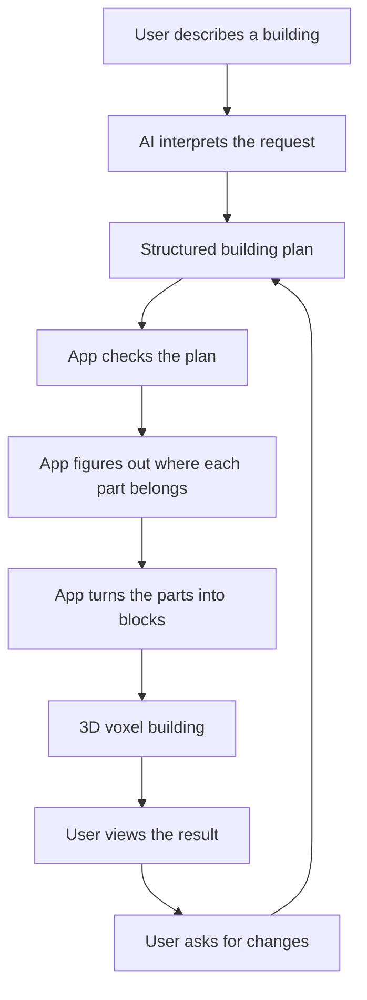

# Voxel Architect

Voxel Architect is a web app for creating Minecraft-like voxel buildings from structured building plans.

Instead of placing every block by hand, the project explores a workflow where a person describes a building, the system turns that idea into a clear building plan, and the app generates a 3D voxel structure from that plan.

**Live demo:** https://voxel-architect.wlc562.workers.dev/

Hosted on **Cloudflare Workers** via OpenNext. See [`docs/deployment/CLOUDFLARE.md`](docs/deployment/CLOUDFLARE.md) for build and deploy details.

---

## What the project does

Voxel Architect currently lets you preview and inspect generated voxel buildings in the browser.

The project focuses on buildings made from understandable parts, such as:

- a main room
- a roof
- doors
- window groups
- a porch
- a chimney
- steps

These parts are easier for a person or an AI assistant to understand than thousands of individual block coordinates.

---

## Live demo

https://voxel-architect.wlc562.workers.dev/

The demo includes:

- a 3D preview page for generated structures
- generic building presets
- a developer lab for inspecting and editing building plans
- a newer component-based building model that organizes buildings into parts like rooms, roofs, doors, windows, porches, chimneys, and steps

---

## Intended workflow

The long-term goal is for a user to describe a building in plain language and then refine it through follow-up requests.

For example, a user might ask:

> Make me a small stone cottage with a dark roof, a front porch, two front windows, and a chimney.

Voxel Architect would not ask the AI to place every single block directly. Instead, the AI would create a structured building plan that says something like:

- create a main room
- attach a roof to the room
- place a door on the front side
- place two windows on the front side
- add a porch near the front door
- add a chimney
- add a front step

The app would then check that this plan makes sense, turn it into a generated voxel building, and show it in the 3D preview.

Then the user could refine the building:

> Make the porch wider and move the chimney to the right side.

The system would update the building plan, check it again, regenerate the structure, and show the updated result.

---

## Process layers



---

## Example walkthrough

A possible future interaction could look like this:

1. The user asks for a cozy stone cottage.
2. The AI creates a building plan with a room, roof, door, windows, porch, chimney, and step.
3. The app checks whether the plan is valid.
4. The app generates the voxel blocks for the building.
5. The user sees the result in the 3D preview.
6. The user asks for changes, such as a wider porch or more windows.
7. The app updates the plan and regenerates the building.

This approach keeps the building editable because the app remembers what each part means. A window is still a window, a porch is still a porch, and a chimney is still a chimney.

---

## Why this approach matters

A building made only from raw block positions is hard to edit. If an AI places thousands of blocks directly, the app may not know which blocks belong to the roof, which belong to the door, or which belong to the porch.

Voxel Architect uses building parts as the main source of truth. That makes it easier to:

- inspect the building
- edit specific parts
- validate the plan
- explain what changed
- eventually support AI-guided edits

---

## Current features

- Live 3D voxel preview
- Generic building presets
- Component-based building plans
- Developer lab for inspecting and editing building parts
- Semantic component tree for buildings
- Editable fields for existing building components
- Validation messages for building plans
- Material controls for generated structures

---

## Developer lab

The developer lab is used to inspect how a building is organized.

It shows the building as a set of meaningful parts, such as:

- Main room
- Front face
- Front door
- Front windows
- Front porch
- Chimney
- Roof

The goal of the lab is to make the building plan easier to understand and edit before adding a full AI chat workflow.

---

## Project direction

Future work may include:

- clearer visual feedback when selecting a building part
- adding and removing components from the developer lab
- AI-generated initial building plans
- AI-assisted edits to existing buildings
- better editing controls for surfaces like the front, back, left, and right sides of a building
- more complex buildings after the current one-room building system is stable

Features intentionally saved for later include:

- multiple rooms
- interior floor plans
- image-based input
- freeform coordinate editing
- direct AI placement of individual blocks

---

## AI use statement

I used **ChatGPT** to help plan the project architecture, discuss design decisions, review implementation reports, and draft documentation.

I used **Cursor** to help implement code changes, refine the UI, generate concept layouts, and run project checks.

---

## Tech stack

- Next.js (deployed with [@opennextjs/cloudflare](https://opennext.js.org/cloudflare) on Cloudflare Workers)
- React
- TypeScript
- React Three Fiber
- Tailwind CSS
- Vitest

---

## Running locally

Install dependencies:

```bash
pnpm install
```

Start the development server:

```bash
pnpm dev
```

Run checks:

```bash
pnpm lint
pnpm test:generator
pnpm exec tsc --noEmit
pnpm run build
```

---

## Author

Walter Lopez Chavez

