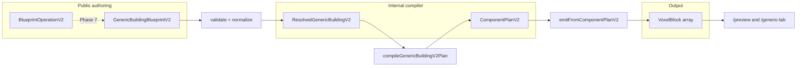

# Plan — GenericBuildingBlueprint v2 (component authoring model)

**Branch:** `feature/component-authoring-model`  
**Status:** Planning only — **no implementation** until review.  
**Goal:** Cohesive implementation of **GenericBuildingBlueprint v2** as an LLM-optimized, component-based semantic architecture compiler, coexisting with **v1** until v2 is stable.

**Related docs (current v1):**

- [`../generation/ARCHITECTURAL_COMPONENT_GRAMMAR.md`](../generation/ARCHITECTURAL_COMPONENT_GRAMMAR.md) — v1 `ComponentPlan` pipeline
- [`../generation/GENERATION_DESIGN_PRINCIPLES.md`](../generation/GENERATION_DESIGN_PRINCIPLES.md) — semantic compiler principles
- [`../generation/GENERATOR_RELIABILITY.md`](../generation/GENERATOR_RELIABILITY.md) — invariant tests
- [`../blueprints/BLUEPRINT_FEATURE_CATALOG.md`](../blueprints/BLUEPRINT_FEATURE_CATALOG.md) — feature taxonomy
- [`../VISION.md`](../VISION.md) — product direction (recipes over monoliths)

---

## Fixed product constraints (do not violate)

| Area | Constraint |
|------|------------|
| Authoring | Constrained **component composition** (`room`, `roof`, `door`, `window_group`, `porch`, `chimney`, `step`); not monolithic whole-building fields |
| IR | **ComponentPlan v2** is private compiler IR — never public editable JSON |
| Coexistence | **schemaVersion** dispatches v1 vs v2; **do not remove v1** until cleanup milestone |
| Migration | Manual v2 presets first; **no automatic v1→v2 converter** in initial work |
| V2.0 scope | **Exactly one root `room`**; attachment-first; no raw coordinates; openings as **first-class** components |
| Deferred | Multiple rooms, walls-as-components, dormers, freeform placement, region selection, image input, **AI runtime**, towers, `blacksmith_workshop` |
| Materials | Global palette + per-component overrides; resolution: **override → blueprint default → compiler default** |
| Validation | Mixed: hard **errors**, safe **normalization notes**, **warnings**; structured for future LLM repair + UI “fix it” |
| Lowering | **New ComponentPlan v2** — do not shoehorn v2 into v1-shaped `ComponentPlan` |
| `/generic-lab` | Human component-tree editor; **no** visual AI operation queue |
| LLM | Full blueprint for create; **semantic operations** for refine; never edit ComponentPlan v2 directly |

---

## 1. Current repo survey

### 1.1 V1 blueprint & validation

| Path | Role | V2 action |
|------|------|-----------|
| [`src/lib/blueprints/types.ts`](../../src/lib/blueprints/types.ts) | `GenericBuildingBlueprint` (`schemaVersion: 1`), `ResolvedGenericBuilding`, `StructureBlueprint` | **Extend** — add v2 types; keep v1 types; union `StructureBlueprint` |
| [`src/lib/blueprints/validateBlueprint.ts`](../../src/lib/blueprints/validateBlueprint.ts) | Dispatches `structureType === "generic_building"` → v1 validator | **Extend** — dispatch on `schemaVersion` |
| [`src/lib/blueprints/validateGenericBuilding.ts`](../../src/lib/blueprints/validateGenericBuilding.ts) | V1 validation, `BlueprintValidationResult` (errors + notes only) | **Leave v1**; v2 gets richer result type |
| [`src/lib/blueprints/sampleGenericBuildingBlueprints.ts`](../../src/lib/blueprints/sampleGenericBuildingBlueprints.ts) | V1 presets (`simple_rustic_cabin`, `shed_roof_workshop`) | **Leave**; add separate v2 preset module |
| [`src/lib/blueprints/__tests__/validateGenericBuilding.test.ts`](../../src/lib/blueprints/__tests__/validateGenericBuilding.test.ts) | V1 validation tests | **Leave**; add v2 validation tests |

**V1 shape assumption:** one monolithic object with `body`, `roof`, `openings`, `features` — conflicts with v2’s **component array** and **surface/anchor** references.

### 1.2 V1 generation & ComponentPlan v1

| Path | Role | V2 action |
|------|------|-----------|
| [`src/lib/generation/generateStructure.ts`](../../src/lib/generation/generateStructure.ts) | `generateStructureFromResolved` → `generateGenericBuilding` | **Extend** — branch on resolved v1 vs v2 |
| [`src/lib/generation/generators/generateGenericBuilding.ts`](../../src/lib/generation/generators/generateGenericBuilding.ts) | v1: compile v1 plan → emit | **Leave** as v1 entry |
| [`src/lib/generation/components/types.ts`](../../src/lib/generation/components/types.ts) | `ComponentPlan` v1, `PlannedComponent` kinds | **Leave**; add `components/v2/types.ts` |
| [`src/lib/generation/components/compileGenericBuildingPlan.ts`](../../src/lib/generation/components/compileGenericBuildingPlan.ts) | Lowers **monolithic** resolved building → fixed ids (`body_main`, `entrance_main`, …) | **Do not extend** for v2 — new `compileGenericBuildingV2Plan.ts` |
| [`src/lib/generation/components/geometry/openingMask.ts`](../../src/lib/generation/components/geometry/openingMask.ts) | Derives masks from **resolved v1** `openings` + `body` | **Refactor shared math** where possible; v2 lowering feeds masks from **door/window_group** plan nodes |
| [`src/lib/generation/components/emitFromComponentPlan.ts`](../../src/lib/generation/components/emitFromComponentPlan.ts) | v1 emitter dispatch + merge + grounding | **Leave**; add `emitFromComponentPlanV2.ts` or parallel dispatch |
| [`src/lib/generation/components/generators/*`](../../src/lib/generation/components/generators/) | foundation, hollowWallShell, entranceOnSide, sparseWindows, roofs, chimney, frontStep | **Reuse/adapt** — many map to v2 plan kinds with different params/provenance |
| [`src/lib/generation/components/priorities.ts`](../../src/lib/generation/components/priorities.ts) | Merge priorities | **Reuse** (possibly extend for porch) |
| [`src/lib/generation/placement/placementUtils.ts`](../../src/lib/generation/placement/placementUtils.ts) | merge, 26-connectivity filter | **Reuse** unchanged |
| [`src/lib/generation/facade/paneAxis.ts`](../../src/lib/generation/facade/paneAxis.ts) | Window pane axis helper | **Reuse** |
| [`src/lib/generation/families/buildingFamilies.ts`](../../src/lib/generation/families/buildingFamilies.ts) | Single `generic_building` family | **Leave** (v2 is same family, new schema version) |

### 1.3 UI routes

| Path | Role | V2 action |
|------|------|-----------|
| [`src/app/preview/PreviewInspectionClient.tsx`](../../src/app/preview/PreviewInspectionClient.tsx) | V1 generic presets + partials | **Extend** — preset groups: “Generic v1” / “Generic v2” |
| [`src/app/preview/page.tsx`](../../src/app/preview/page.tsx) | Preview shell copy | **Update** when v2 presets ship |
| [`src/app/generic-lab/GenericLabClient.tsx`](../../src/app/generic-lab/GenericLabClient.tsx) | Monolithic form editor for v1 | **Extend** — schemaVersion toggle or tab: v1 editor vs **v2 component tree** |
| [`src/app/generic-lab/genericLabUtils.ts`](../../src/app/generic-lab/genericLabUtils.ts) | V1 clamps, preset clone | **Extend** — v2 tree helpers |
| [`src/app/generic-lab/GenericLabInspectionPanel.tsx`](../../src/app/generic-lab/GenericLabInspectionPanel.tsx) | Layer/breakdown (preset-agnostic) | **Reuse** for v2 preview |
| [`src/components/voxel/VoxelViewer.tsx`](../../src/components/voxel/VoxelViewer.tsx) | R3F viewer | **Leave** |
| [`src/components/voxel/StructureInspectionPanel.tsx`](../../src/components/voxel/StructureInspectionPanel.tsx) | Preview side panel | **Extend** preset grouping for v2 |

### 1.4 Tests & docs

| Path | Role | V2 action |
|------|------|-----------|
| `src/lib/generation/__tests__/generatorGenericPresetInvariants.test.ts` | V1 preset invariants | **Leave** |
| `src/lib/generation/__tests__/generatorPipeline.smoke.test.ts` | Smoke (v1 default) | **Add** v2 smoke; keep v1 |
| `src/lib/generation/components/__tests__/compileGenericBuildingPlan.test.ts` | v1 lowering | **Leave** |
| `docs/generation/ARCHITECTURAL_COMPONENT_GRAMMAR.md` | Documents v1 | **Add** v2 section or sibling doc after Phase 8 |
| `docs/blueprints/BLUEPRINT_JSON_FORMAT.md` | Generic internal JSON | **Update** — v2 authoring, still no public ComponentPlan |

### 1.5 Conflicting v1 assumptions (must not carry into v2)

1. **Single implicit “main body”** — v1 hardcodes `body_main`, `entrance_main`, `roof_main` in compiler; v2 uses **author-defined slug IDs** and **surface references** (`main-room.front`).
2. **Openings nested in blueprint** — v1 `openings.entrance` / `openings.windows`; v2 **`door`** and **`window_group`** are sibling components.
3. **Features flags** — v1 `features.chimney.enabled` / `frontStep.enabled`; v2 **optional components** in the `components` array.
4. **Entrance side on building** — v2 door targets a **surface**; compiler maps surface → facade side + span.
5. **Window mode enum on building** — v2 `window_group` has distribution + height band per group.
6. **Validation result shape** — v1 flat `errors[]` / `notes[]`; v2 needs **paths, component IDs, severity, codes** for LLM repair.
7. **Lowering = field copy** — v1 `compileGenericBuildingToComponentPlan` is mostly structural mapping; v2 lowering must **resolve attachments**, build **plan graph**, and derive **aperture masks** from multiple opening components.

---

## 2. Proposed file / module layout

```
src/lib/blueprints/
  types.ts                          # extend: v1 types unchanged; export v2 + unions
  types/
    genericBuildingV1.ts            # optional: move v1 types here when types.ts grows
    genericBuildingV2.ts            # public v2 authoring + resolved v2
    materials.ts                    # shared palette / override types
    validationResult.ts             # structured ValidationResult (v2); v1 adapter
  validateBlueprint.ts              # schemaVersion dispatch
  validateGenericBuilding.ts        # v1 only (rename clarity optional)
  validateGenericBuildingV2.ts      # v2 validate + normalize
  resolveGenericBuildingV2.ts       # resolved semantic graph (surfaces, anchors)
  sampleGenericBuildingBlueprints.ts  # v1 presets (unchanged)
  sampleGenericBuildingBlueprintsV2.ts
  operations/
    types.ts                        # LLM semantic operation unions
    applyOperations.ts              # Phase 7+: apply ops to blueprint (pure)
  __tests__/
    validateGenericBuildingV2.test.ts
    resolveGenericBuildingV2.test.ts
    operations.test.ts              # Phase 7

src/lib/generation/
  generateStructure.ts              # dispatch resolved v1 | v2
  generators/
    generateGenericBuilding.ts      # v1 entry (unchanged)
    generateGenericBuildingV2.ts    # v2 entry
  components/
    v1/                             # optional rename: move existing v1 files
      types.ts
      compileGenericBuildingPlan.ts
      emitFromComponentPlan.ts
      ...
    v2/
      types.ts                      # ComponentPlanV2, PlanComponent union
      compileGenericBuildingV2Plan.ts
      emitFromComponentPlanV2.ts
      resolveAttachments.ts
      deriveSurfaces.ts
      deriveApertureMasksV2.ts
      planContextV2.ts
      generators/
        roomShell.ts
        roof.ts
        door.ts
        windowGroup.ts
        porch.ts
        chimney.ts
        step.ts
      __tests__/
        compileGenericBuildingV2Plan.test.ts
        deriveApertureMasksV2.test.ts
        emitV2.invariants.test.ts
        fixtures/
          validV2Presets.ts
          invalidV2Blueprints.ts

src/app/generic-lab/
  GenericLabClient.tsx              # v1 editor + v2 mode switch
  v2/
    GenericLabV2Client.tsx            # component tree shell (or split file)
    ComponentTreePanel.tsx
    ComponentInspectorPanel.tsx
    ValidationPanel.tsx
    genericLabV2Utils.ts
  ...

src/app/preview/
  PreviewInspectionClient.tsx       # v1 + v2 preset sections
```

**Docs (Phase 8):**

- `docs/generation/GENERIC_BUILDING_V2_GRAMMAR.md` — public v2 components + attachment vocabulary
- `docs/blueprints/GENERIC_BUILDING_V2_SCHEMA.md` — schema reference (TypeScript mirrors)
- Update `ARCHITECTURAL_COMPONENT_GRAMMAR.md` — mark v1, link v2
- Update `GENERATOR_RELIABILITY.md` — v2 test inventory

---

## 3. Proposed V2 schema (TypeScript shapes)

### 3.1 Root blueprint

```ts
/** Public authoring — LLM and /generic-lab edit this. */
export interface GenericBuildingBlueprintV2 {
  readonly structureType: "generic_building";
  readonly schemaVersion: 2;
  readonly metadata: BlueprintMetadata;
  readonly defaults: BlueprintMaterialDefaults; // global palette roles
  readonly constraints: BlueprintConstraints;
  readonly components: readonly GenericBuildingComponentV2[];
}

export type StructureBlueprint =
  | GenericBuildingBlueprint   // schemaVersion: 1
  | GenericBuildingBlueprintV2;

export interface BlueprintMaterialDefaults {
  readonly wall: ClassicMaterialKey;
  readonly floor: ClassicMaterialKey;
  readonly roof: ClassicMaterialKey;
  readonly window: ClassicMaterialKey;
  readonly door: ClassicMaterialKey;
  readonly accent: ClassicMaterialKey;
}

export interface ComponentMaterialOverride {
  readonly wall?: ClassicMaterialKey;
  readonly floor?: ClassicMaterialKey;
  readonly roof?: ClassicMaterialKey;
  readonly window?: ClassicMaterialKey;
  readonly door?: ClassicMaterialKey;
  readonly accent?: ClassicMaterialKey;
}
```

### 3.2 Component identity

```ts
/** Canonical programmatic identity — slug, stable across edits. */
export type ComponentId = string; // validated: /^[a-z][a-z0-9-]*$/

export interface ComponentBaseV2 {
  readonly id: ComponentId;
  readonly type: GenericBuildingComponentTypeV2;
  /** Human display only; not used for references. */
  readonly label?: string;
  readonly materials?: ComponentMaterialOverride;
}

export type GenericBuildingComponentTypeV2 =
  | "room"
  | "roof"
  | "door"
  | "window_group"
  | "porch"
  | "chimney"
  | "step";

export type GenericBuildingComponentV2 =
  | RoomComponentV2
  | RoofComponentV2
  | DoorComponentV2
  | WindowGroupComponentV2
  | PorchComponentV2
  | ChimneyComponentV2
  | StepComponentV2;
```

### 3.3 Semantic references

```ts
/** Room face — compiler derives from root room id + side. */
export type RoomSurfaceRef = `${ComponentId}.${RoomFace}`;
export type RoomFace = "front" | "back" | "left" | "right" | "roof";

/** Attachment to a room surface (doors, windows, porches, chimneys). */
export interface SurfaceAttachment {
  readonly surface: RoomSurfaceRef;
  readonly placement: HorizontalPlacementV2;
}

export interface HorizontalPlacementV2 {
  readonly align: "start" | "center" | "end"; // along facade horizontal axis
  // defer: offsetCells, corner targets
}

/** Attachment to another component (steps → door). */
export interface ComponentAnchorRef {
  readonly anchor: ComponentId; // e.g. "front-door"
}

export interface DoorAnchorAttachment {
  readonly door: ComponentId;
}
```

### 3.4 Component variants

```ts
export interface RoomComponentV2 extends ComponentBaseV2 {
  readonly type: "room";
  readonly width: number;
  readonly depth: number;
  readonly wallHeight: number; // wall layers above y=0 slab
  readonly wallThickness: number;
  readonly hollowInterior: boolean;
  // V2.0: only one room; must be designated root (see validation)
  readonly role?: "root"; // optional explicit marker; else inferred if sole room
}

export type RoofKindV2 = "pitched_gable" | "shed" | "none";
export type ShedOrientationV2 = "front_back" | "left_right"; // clarify in §16

export interface RoofComponentV2 extends ComponentBaseV2 {
  readonly type: "roof";
  readonly target: RoomSurfaceRef; // must be `{rootId}.roof`
  readonly kind: RoofKindV2;
  readonly layers?: number;
  readonly overhang?: number;
  readonly orientation?: ShedOrientationV2; // shed only
}

export interface DoorComponentV2 extends ComponentBaseV2 {
  readonly type: "door";
  readonly attach: SurfaceAttachment;
  readonly width: number;
  readonly height: number;
}

export type WindowDistributionV2 = "single" | "pair" | "row"; // constrained set for V2.0
export type WindowHeightBandV2 = "auto" | "mid" | "upper";

export interface WindowGroupComponentV2 extends ComponentBaseV2 {
  readonly type: "window_group";
  readonly attach: SurfaceAttachment;
  readonly count: number;
  readonly distribution: WindowDistributionV2;
  readonly heightBand?: WindowHeightBandV2;
}

export type PorchWidthModeV2 = "door_only" | "full_facade"; // clarify in §16

export interface PorchComponentV2 extends ComponentBaseV2 {
  readonly type: "porch";
  readonly attach: SurfaceAttachment;
  readonly depth: number; // cells outward from wall
  readonly widthMode: PorchWidthModeV2;
  readonly aroundDoor?: ComponentId; // optional link when widthMode = door_only
}

export interface ChimneyComponentV2 extends ComponentBaseV2 {
  readonly type: "chimney";
  readonly attach: SurfaceAttachment; // wall surface (left/right/front/back)
}

export interface StepComponentV2 extends ComponentBaseV2 {
  readonly type: "step";
  readonly attach: DoorAnchorAttachment;
}
```

### 3.5 Resolved v2 (internal authoring snapshot)

```ts
/** Output of validation+resolution — not public JSON. */
export interface ResolvedGenericBuildingV2 {
  readonly structureType: "generic_building";
  readonly schemaVersion: 2;
  readonly metadata: BlueprintMetadata;
  readonly constraints: BlueprintConstraints;
  readonly rootRoomId: ComponentId;
  readonly materials: ResolvedMaterialPalette; // all roles → BlockTypeId
  readonly components: readonly ResolvedComponentV2[];
  readonly surfaces: ReadonlyMap<RoomSurfaceRef, ResolvedSurfaceV2>;
  readonly anchors: ReadonlyMap<ComponentId, ResolvedAnchorV2>;
  readonly grid: PlanBoundsV2; // compiler-assigned origin at (0,0), room footprint
}

export interface ResolvedComponentV2 {
  readonly id: ComponentId;
  readonly type: GenericBuildingComponentTypeV2;
  readonly materials: ResolvedMaterialPalette; // after inheritance
  // type-specific resolved fields + resolved attachment targets
}
```

---

## 4. Proposed validation result shape

```ts
export type ValidationSeverity = "error" | "warning" | "note";

export interface ValidationIssue {
  readonly severity: ValidationSeverity;
  readonly code: string;           // e.g. "duplicate_component_id"
  readonly message: string;        // human-readable
  readonly path?: string;           // JSON pointer-ish: "/components/2/width"
  readonly componentId?: ComponentId;
  readonly surface?: RoomSurfaceRef;
  readonly anchor?: ComponentId;
  /** Future: LLM-facing repair hint */
  readonly suggestion?: string;
}

export interface BlueprintValidationResultV2 {
  readonly ok: boolean;
  readonly errors: readonly ValidationIssue[];
  readonly warnings: readonly ValidationIssue[];
  readonly notes: readonly ValidationIssue[]; // normalization
  readonly resolved?: ResolvedGenericBuildingV2;
  readonly normalized?: GenericBuildingBlueprintV2; // if safe fixes applied
}

/** Adapter: v1 keeps simple string[] for backward compat or unify later. */
```

**Error examples (hard):** duplicate id, zero rooms, multiple rooms, missing root, unknown surface, door larger than facade span, invalid material key, step not attached to door, roof target not `.roof`.

**Note examples (normalization):** clamped `wallHeight`, defaulted `layers`, defaulted `align: "center"`, inserted missing optional fields.

**Warning examples:** window count high for facade, porch depth large, chimney on front facade.

---

## 5. Resolution model

```text
GenericBuildingBlueprintV2 (authoring)
  → parse / structural checks (ids, types, duplicates)
  → detect exactly one room → rootRoomId
  → per-component type validation
  → resolve material inheritance (override → defaults → compiler fallbacks)
  → build surface catalog from root room:
        main-room.front | .back | .left | .right | .roof
  → resolve each attachment:
        surface → facade side, span range, outward normal
        door anchor → doorway cell frame on resolved facade
  → group openings per facade (doors + window_groups)
  → plan aperture cells (shell skip, window fill, door trim bands)
  → compute PlanBoundsV2 (W, D, bodyLayers, roofLayers, origin)
  → estimate block budget vs constraints.maxBlockCount
  → ResolvedGenericBuildingV2
```

| Step | Responsibility |
|------|----------------|
| ID validation | Regex `^[a-z][a-z0-9-]*$`, unique set |
| Root room | Count `type === "room"` === 1; else error |
| Material inheritance | Per-component resolved palette for emitters |
| Surface derivation | Cartesian room box at origin; faces named relative to room id |
| Target resolution | Parse `roomId.face`; verify room exists and is root |
| Anchor resolution | `step.attach.door` must reference `type === "door"` |
| Opening grouping | By facade side; validate non-overlap where possible |
| Aperture planning | Merge door + window masks; y=0 floor band rules preserved from v1 |
| Bounds | Same conventions as v1: y=0 slab, walls from y=1, roof above body |
| Budget | Reuse v1-style estimate or sum plan component estimates |

**No user-authored world coordinates** in V2.0 — compiler assigns global lattice from root room footprint at origin.

---

## 6. ComponentPlan v2 design

### 6.1 Layering

| Layer | Contents | Public? |
|-------|----------|---------|
| `GenericBuildingBlueprintV2` | Semantic components + attachments | **Yes** |
| `ResolvedGenericBuildingV2` | Resolved surfaces, materials, grid | **Internal** |
| `ComponentPlanV2` | Emit-ready plan graph + derived masks | **Internal** |
| `VoxelBlock[]` | Output | Inspectable, not authoring |

### 6.2 ComponentPlanV2 shape

```ts
export interface ComponentPlanV2 {
  readonly planVersion: 2;
  readonly sourceSchemaVersion: 2;
  readonly rootRoomId: ComponentId;
  readonly bounds: PlanBoundsV2;
  readonly materials: ResolvedMaterialPalette;
  readonly constraints: BlueprintConstraints;
  readonly openings: DerivedOpeningsV2; // shellSkip, window, door masks
  readonly components: readonly PlanComponentV2[];
  readonly compileNotes?: readonly string[];
}

export interface PlanBoundsV2 {
  readonly origin: { readonly x: number; readonly y: number; readonly z: number };
  readonly width: number;
  readonly depth: number;
  readonly bodyLayers: number;
  readonly roofLayers: number;
  readonly overhang: number;
}

export type PlanComponentV2 =
  | PlanRoomShellV2
  | PlanRoofV2
  | PlanDoorV2
  | PlanWindowGroupV2
  | PlanPorchV2
  | PlanChimneyV2
  | PlanStepV2;

export interface PlanRoomShellV2 {
  readonly id: ComponentId;
  readonly kind: "room_shell";
  readonly sourceComponentId: ComponentId;
  readonly params: {
    readonly width: number;
    readonly depth: number;
    readonly wallHeight: number;
    readonly wallThickness: number;
    readonly hollowInterior: boolean;
  };
}

export interface PlanDoorV2 {
  readonly id: ComponentId;
  readonly kind: "door";
  readonly sourceComponentId: ComponentId;
  readonly facade: FacadeSideV2;
  readonly aperture: DoorApertureV2; // resolved cells / local keys
}

// ... PlanRoofV2, PlanWindowGroupV2, PlanPorchV2, PlanChimneyV2, PlanStepV2
```

**Do not** reuse v1 kinds (`entrance_on_side`, `sparse_windows`) in v2 plan — map explicitly in lowering:

| Authoring | ComponentPlan v2 | Emitter (initial) |
|-----------|------------------|-------------------|
| `room` | `room_shell` | foundation + hollow shell (split or combined) |
| `door` | `door` | door trim + aperture (from v1 entrance emitter logic) |
| `window_group` | `window_group` | sparse window emitter with resolved slots |
| `roof` | `roof` | pitched_gable / shed / none |
| `porch` | `porch` | **new** porch emitter (v2.0) |
| `chimney` | `chimney` | adapt v1 chimney |
| `step` | `step` | adapt v1 frontStep (door-anchored) |

### 6.3 Provenance (optional V2.0)

Keep provenance **internal** first:

```ts
interface GeneratorPlacementV2 extends GeneratorPlacement {
  readonly sourceComponentId?: ComponentId;
  readonly sourcePlanKind?: string;
}
```

Defer exposing provenance on public `VoxelBlock` until needed for inspection UI.

---

## 7. Emitters

### 7.1 Pipeline

```text
ComponentPlanV2
  → createPlanContextV2(plan)
  → for each plan component in emission order:
        emit* → GeneratorPlacement[]
  → mergePlacements (COMPONENT_PRI + insertion order)
  → filterGroundedConnected26 (unless allowFloatingBlocks)
  → VoxelBlock[]
```

### 7.2 Emission order (proposed)

1. `room_shell` (foundation + floor slab + walls)
2. `porch` (may affect shell skip near facade)
3. `door` / `window_group` (aperture masks already applied in shell pass)
4. `roof`
5. `chimney`
6. `step`

Exact order tuned to match v1 priority semantics (`priorities.ts`).

### 7.3 Shared behavior

| Concern | Approach |
|---------|----------|
| Aperture masks | `deriveApertureMasksV2(resolved)` before emit; shell skips doorway/window cells |
| Merge | Reuse `mergePlacements`; higher priority wins per cell |
| Duplicates | Assert zero duplicate coordinates in tests |
| Pane windows | Reuse `paneAxisForWindowCell` when window material allows pane |
| Grounding | Reuse `filterGroundedConnected26` |

### 7.4 New work

- **Porch emitter** — footprint in front of facade; coordinate with door mask when `aroundDoor` / `door_only` width mode
- **Multi-opening facades** — multiple `window_group` on same surface: validate total span / count

---

## 8. V1 / V2 dispatch

```ts
// validateBlueprint(blueprint)
if (blueprint.structureType !== "generic_building") return unsupported;
switch (blueprint.schemaVersion) {
  case 1: return validateGenericBuildingBlueprint(blueprint);
  case 2: return validateGenericBuildingBlueprintV2(blueprint);
  default: return error unknown schemaVersion;
}

// generateStructureFromResolved(resolved)
if (resolved.schemaVersion === 1) return generateGenericBuilding(resolved);
if (resolved.schemaVersion === 2) return generateGenericBuildingV2(resolved);
```

- **No changes** to v1 preset JSON files in early phases.
- **All existing v1 tests** must remain green until v1 retirement branch.
- `StructureBlueprint` union widens; call sites that assume v1 only must narrow on `schemaVersion`.

---

## 9. Presets

### 9.1 Location

`src/lib/blueprints/sampleGenericBuildingBlueprintsV2.ts`

```ts
export const GENERIC_BUILDING_V2_PRESETS = [
  { id: "simple_cabin_v2", label: "Simple cabin (v2)", blueprint: ... },
  { id: "stone_workshop_v2", label: "Stone workshop (v2)", blueprint: ... },
  { id: "porch_house_v2", label: "Porch house (v2)", blueprint: ... },
] as const;
```

### 9.2 Preset intent

| Preset | Maps from v1 demo | Components (illustrative ids) |
|--------|-------------------|-------------------------------|
| **simple_cabin_v2** | `simple_rustic_cabin` | `main-room`, `main-roof`, `front-door`, `front-windows`, `chimney`, `front-step` |
| **stone_workshop_v2** | `shed_roof_workshop` | wider room, shed roof, larger door, side window groups |
| **porch_house_v2** | new | room + gable roof + door + windows + **porch** + step |

Manual authoring only — no v1→v2 converter in initial milestones.

### 9.3 `/preview` integration

- Extend `PreviewLabSource` or add sub-mode:
  - `preset_generic_v1` (existing)
  - `preset_generic_v2` (new)
- Preset picker: grouped sections **“Generic v1”** / **“Generic v2”**.
- Default remains **v1** until v2 is primary (product decision milestone).

---

## 10. `/generic-lab` V2 UI

### 10.1 Layout (target)

```text
┌─────────────────────────────────────────────────────────────┐
│ Header: preset | schema v1/v2 toggle | link to /preview      │
├──────────────┬──────────────────────────┬───────────────────┤
│ Component    │ Voxel preview            │ Validation panel  │
│ tree         │ (VoxelViewer)            │ errors/warnings/  │
│              │                          │ notes + fix hints │
│              ├──────────────────────────┤                   │
│              │ Inspector (selected node)│ (optional)        │
├──────────────┴──────────────────────────┴───────────────────┤
│ Collapsible: read-only V2 JSON | debug ComponentPlan v2      │
└─────────────────────────────────────────────────────────────┘
```

### 10.2 Tree grouping (V2.0)

- **Room** `main-room`
  - Surfaces: front / back / left / right / roof (virtual folders)
    - Attached: doors, window_groups, porches, chimneys targeting that surface
- **Roof** (targets `.roof`)
- **Steps** (under door nodes)

### 10.3 Implementation staging

| Milestone | UI capability |
|-----------|----------------|
| **Phase 6a** | Read-only: load v2 preset, show tree + validation + preview |
| **Phase 6b** | Select component; inspector edits fields; revalidate |
| **Phase 6c** | Add/remove components with suggested ids; material override editor |
| **Later** | “Fix it” buttons from `ValidationIssue.suggestion` |

**Do not** build AI operation queue UI. LLM integration stays programmatic.

**V1 editor** remains available via schema toggle or separate tab for regression.

---

## 11. LLM operation model

### 11.1 Types (plan)

```ts
export type BlueprintOperationV2 =
  | AddComponentOperation
  | UpdateComponentOperation
  | RemoveComponentOperation
  | SetMaterialPaletteOperation
  | SetMaterialOverrideOperation;

export interface AddComponentOperation {
  readonly op: "addComponent";
  readonly component: GenericBuildingComponentV2;
}

export interface UpdateComponentOperation {
  readonly op: "updateComponent";
  readonly id: ComponentId;
  readonly patch: Partial</* per-type fields */>;
}

export interface RemoveComponentOperation {
  readonly op: "removeComponent";
  readonly id: ComponentId;
}

export interface SetMaterialPaletteOperation {
  readonly op: "setMaterialPalette";
  readonly defaults: Partial<BlueprintMaterialDefaults>;
}

export interface SetMaterialOverrideOperation {
  readonly op: "setMaterialOverride";
  readonly id: ComponentId;
  readonly materials: ComponentMaterialOverride;
}
```

### 11.2 Staged delivery (recommendation)

| Phase | Deliverable |
|-------|-------------|
| **Phase 7a** | `operations/types.ts` + JSON schema comments in docs only |
| **Phase 7b** | `applyOperations(blueprint, ops)` pure function + unit tests |
| **Later** | HTTP/SDK endpoint, repair loop, LLM prompts |

**Recommendation:** Implement **types + `applyOperations` in Phase 7** after v2 validate/compile works — enables LLM refinement without UI. Do **not** block Phases 1–6 on operations.

**Initial generation:** LLM outputs full `GenericBuildingBlueprintV2` document, not operations.

---

## 12. Tests

### 12.1 New tests

| Area | File | Cases |
|------|------|-------|
| Validation | `validateGenericBuildingV2.test.ts` | valid presets; duplicate id; no room; two rooms; bad slug id |
| Surfaces | `resolveGenericBuildingV2.test.ts` | invalid surface ref; roof target not `.roof` |
| Openings | `validateGenericBuildingV2.test.ts` | door too wide; window count vs span |
| Materials | `validateGenericBuildingV2.test.ts` | override wins; unknown key error |
| Lowering | `compileGenericBuildingV2Plan.test.ts` | plan kinds present; bounds; masks non-empty |
| Emit | `emitV2.invariants.test.ts` | `assertGeneratedStructureHardInvariants` per v2 preset |
| Smoke | `generatorPipelineV2.smoke.test.ts` | validate → generate non-empty |
| Operations | `operations.test.ts` | add/update/remove component |

### 12.2 Preserved tests (v1)

All existing v1 tests remain until v1 retirement:

- `validateGenericBuilding.test.ts`
- `compileGenericBuildingPlan.test.ts`
- `generatorGenericPresetInvariants.test.ts`
- `generatorPipeline.smoke.test.ts` (v1 path)

### 12.3 Shared utilities

Reuse `src/lib/generation/__tests__/testUtils.ts` invariant helpers.

---

## 13. Phased implementation plan

### Phase 1 — Types + fixtures + docs skeleton

- Add v2 types, `StructureBlueprint` union, `schemaVersion` guards
- Fixture JSON/TS for 3 v2 presets (invalid + valid)
- `docs/blueprints/GENERIC_BUILDING_V2_SCHEMA.md` (draft)
- **No dispatch, no emitters**

**Exit:** `tsc` passes; fixtures typecheck; v1 untouched

### Phase 2 — Validation + normalization

- `validateGenericBuildingBlueprintV2`, `BlueprintValidationResultV2`
- ID rules, root room, material resolution, attachment structural checks
- Normalization notes (clamps, defaults)

**Exit:** validation unit tests green

### Phase 3 — Resolution + ComponentPlan v2 lowering

- `resolveGenericBuildingV2`
- `compileGenericBuildingV2Plan` + `deriveApertureMasksV2`
- **No voxel emit yet** — snapshot tests on plan JSON

**Exit:** lowering tests green

### Phase 4 — Emitters + generation tests

- `generateGenericBuildingV2`, `emitFromComponentPlanV2`
- Reuse/adapt v1 generators; implement porch
- Wire `generateStructure` dispatch
- Invariant tests per v2 preset

**Exit:** `pnpm test:generator` includes v2 suite; v1 still green

### Phase 5 — Presets + `/preview`

- Ship `sampleGenericBuildingBlueprintsV2.ts`
- Preview grouped v1/v2 presets
- Update preview copy

**Exit:** manual preview check both groups

### Phase 6 — `/generic-lab` component tree

- 6a read-only tree + preview
- 6b inspector editing
- 6c add/remove components
- v1 monolithic editor remains

**Exit:** edit v2 preset end-to-end in lab

### Phase 7 — LLM operations (optional branch)

- Types + `applyOperations` + tests
- Document operation envelope (not public ComponentPlan)

### Phase 8 — Docs + v1 deprecation prep

- Grammar doc, reliability inventory, feature catalog v2 section
- Document v1 retirement criteria (§14 below)
- **Do not remove v1** in this phase

### Validation commands (every implementation PR)

```bash
pnpm lint
pnpm test:generator
pnpm exec tsc --noEmit
pnpm run build
```

---

## 14. V1 deprecation criteria (future cleanup branch)

V1 may be retired only when:

- [ ] Multiple manually authored **v2** presets cover current visible demo cases (cabin, workshop, porch house)
- [ ] Each v2 preset validates, compiles through **ComponentPlan v2**, renders in `/preview` and `/generic-lab`
- [ ] Tests cover v2 validation, lowering, emission, structural invariants
- [ ] `pnpm lint`, `pnpm test:generator`, `tsc`, `build` pass
- [ ] Docs identify **v2 as active** generic path
- [ ] `/generic-lab` v2 editor is primary; v1 hidden or fixture-only

Then: delete v1 types/presets/compiler paths in a dedicated **cleanup** branch (out of scope here).

---

## 15. Clarifications needed before implementation

1. **Material vocabulary** — Confirm v2.0 uses the same `CLASSIC_BLOCK_PACK` keys as v1 (`cobblestone`, `oak_planks`, `glass`, …). Any new roles beyond wall/floor/roof/window/door/accent?

2. **Roof kinds / shed orientation** — Is `ShedOrientationV2` (`front_back` vs `left_right`) the correct v2.0 vocabulary? Should `none` roof omit the `roof` component or allow `kind: "none"`?

3. **Root room defaults** — Default ranges for `width`/`depth`/`wallHeight`/`wallThickness`: reuse v1 clamps (W 5–17, D 5–13, height 4–9, T 1–2)?

4. **Step attachment** — V2.0: **only** `step → door`, or may step attach to porch edge later? Plan assumes **door only** for v2.0.

5. **Porch attachment** — For `porch_house_v2`: does porch **only** target a room surface, with optional `aroundDoor` id for width alignment? Or must porch always reference a door component?

6. **`/generic-lab` first ship** — Is **Phase 6a read-only** acceptable for first user-visible v2 lab milestone, or is minimal editing required before merging?

7. **Provenance** — Should v2.0 include internal `sourceComponentId` on placements only, or also extend inspection UI to show per-component block counts?

8. **Preview default** — When v2 stabilizes, switch default preset group to v2, or keep v1 default until cleanup?

9. **Window distribution** — Confirm v2.0 enum: `single` | `pair` | `row` vs reusing v1 `mode` strings. How should `row` interact with `count`?

10. **Chimney placement** — Wall surface only, or allow `{root}.roof` attachment in v2.0?

11. **Validation codes** — Prefer stable `code` snake_case registry in a const object for LLM repair mapping?

12. **File layout** — Approve `components/v1/` + `components/v2/` split (requires moving existing v1 files) vs flat `components/v2/` only with v1 paths unchanged?

---

## Appendix — Architecture diagram



```text
Coexistence:

GenericBuildingBlueprint (schemaVersion: 1)  →  ComponentPlan v1  →  emit v1
GenericBuildingBlueprintV2 (schemaVersion: 2) →  ComponentPlanV2 →  emit v2
```
